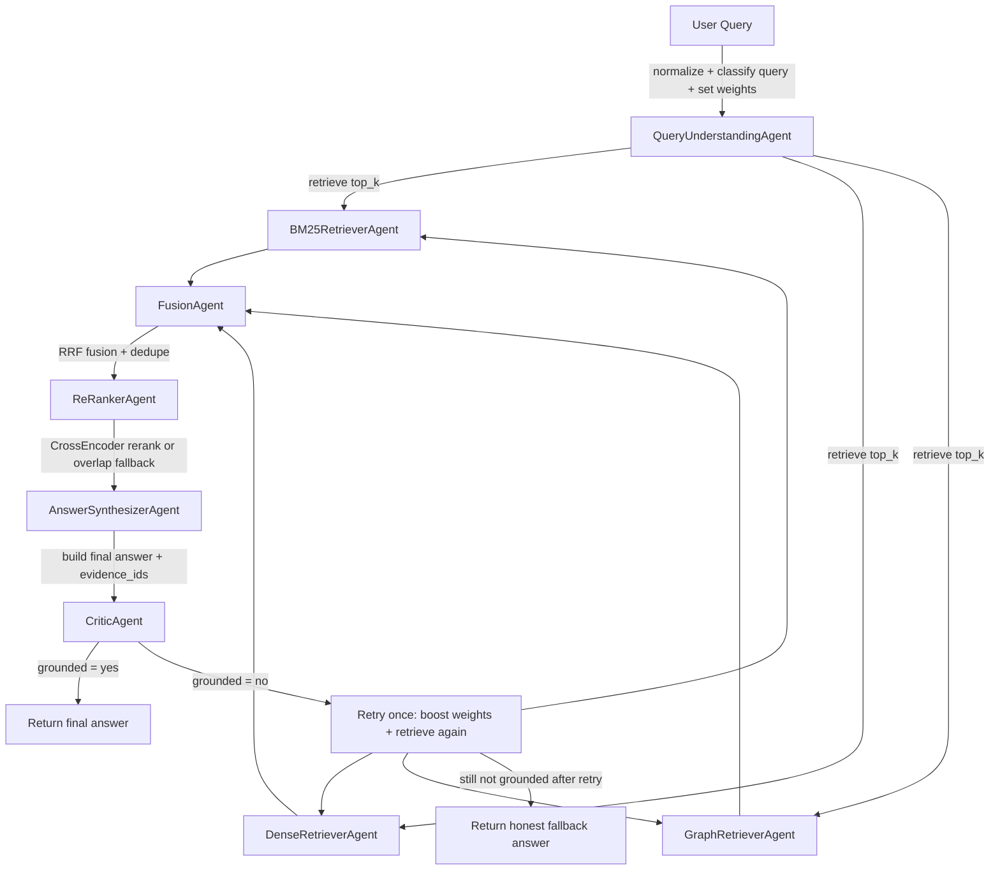

This file is a explanation of the components and structure for my own understanding and memory.
## For step1.ipynb
### Retrieval Techniques Overview
1. BM25 (Sparse Retrieval)
Mechanism: A statistical method that ranks documents based on keyword matching. It considers term frequency (how often a term appears in a document) and inverse document frequency (how rare a term is across the corpus), along with document length normalization.
Strengths: Fast, efficient, good for keyword-based queries, robust baseline.
Weaknesses: Lacks semantic understanding; struggles with synonyms, paraphrases, and contextual meaning.
2. Dense Retrieval (e.g., DPR, ColBERT, E5)
Mechanism: Uses neural networks (embedding models) to transform both queries and documents into dense numerical vectors (embeddings) in a high-dimensional space. Retrieval is then performed by finding documents whose embeddings are semantically closest to the query embedding.
Strengths: Excellent semantic understanding, captures context, handles synonyms and paraphrases effectively.
Weaknesses: Computationally more intensive (especially for embedding generation and vector search), requires robust vector indexing infrastructure.
3. Hybrid/Ensemble Retrieval
Mechanism: Combines multiple retrieval methods (e.g., BM25 and Dense Retrieval) to leverage the strengths of each. Often uses techniques like Reciprocal Rank Fusion (RRF) to merge and re-rank results from different retrievers.
Strengths: Often outperforms individual retrieval methods by combining lexical precision with semantic understanding; considered a best practice in many real-world systems.
Weaknesses: More complex to implement and manage than single-method approaches.
4. Re-ranking Models
Mechanism: Applied as a second stage after initial retrieval. A more powerful (and typically slower) neural model (e.g., a cross-encoder transformer) re-scores a smaller set of top-N candidates from the initial retrieval to refine their ranking based on deeper contextual relevance.
Strengths: Significantly improves precision and relevance at the top of the search results by applying advanced contextual understanding.
Weaknesses: Computationally expensive, only feasible for a small subset of initially retrieved documents.
5. Graph-based Retrieval (e.g., GraphRAG)
Mechanism: (As implemented in the notebook) Leverages a graph structure (e.g., a graph of document communities or relationships) to guide the retrieval process. It often involves a two-stage approach: first identifying relevant graph components (like communities), then scoring candidate documents within those components using semantic similarity.
Strengths: Can uncover relationships and contextual information, effective for grouping semantically related content.
Weaknesses: Can be complex to build and maintain the graph structure; not a traditional knowledge graph but rather a document-relationship graph for retrieval enhancement.
## For step2.ipynb

### The agents implemented are:
Query Understanding Agent: Analyzes the input query.
Retriever Agents: (BM25, Dense, GraphRAG) – Fetch relevant documents using different retrieval mechanisms.
Fusion Agent: Merges and deduplicates results from multiple retrievers.
Re-Ranker Agent: Re-ranks the fused documents for better relevance.
Answer Synthesizer Agent: Generates a final answer based on the re-ranked documents.
Critic Agent: Evaluates the generated answer for grounding and coherence, potentially triggering a re-retrieval if necessary.

### differences between step1 and step2

Step 1 mindset: “Which retriever performs best?”
Query → BM25 / Dense / GraphRAG / Hybrid / ReRank → metrics (P@k, Recall, MRR)

Step 2 mindset: “How should multiple agents collaborate?”
Query → QueryUnderstandingAgent → RetrieverAgents (BM25/Dense/GraphRAG) → FusionAgent → ReRankerAgent → AnswerSynthesizerAgent → CriticAgent (optional retry)

What is same vs different

Same (reused from Step 1):
Core retrieval techniques: BM25, Dense, GraphRAG
Fusion idea (RRF), reranking idea
Same data/artifacts and mostly same retrieval logic
Different (new in Step 2):
Retrieval is now put into Retriever Agent classes
Added non-retrieval agents:
QueryUnderstandingAgent
FusionAgent
ReRankerAgent
AnswerSynthesizerAgent
CriticAgent
Added shared state (AgentState) and pipeline logic (including retry when critic says low grounding)
Built for orchestration strategies later (parallel, confidence routing, etc.)
In one sentence Step 1 is about benchmarking retrieval methods; Step 2 is about turning those methods into a modular multi-agent system that can reason, combine, verify, and support smarter orchestration.

### Step2 code understanding (brief)

Main idea: Step2 reuses Step1 retrievers, but wraps them into agents and adds control logic (state, critic, retry).



Essential reading order in code:
1. `AgentState` (shared data object)
2. `QueryUnderstandingAgent` (query type + weights)
3. Retriever agents (`BM25`, `Dense`, `Graph`)
4. `FusionAgent` and `ReRankerAgent`
5. `AnswerSynthesizerAgent` and `CriticAgent`
6. `MultiAgentPipeline.run()` (full execution + retry flow)

### Step2 agents actions (separate step flow)

#### 0) Shared state (`AgentState`)
Flow: Query comes in -> agents read/write one shared object -> final answer is produced.

Essential code:
```python
@dataclass
class AgentState:
    query: str
    normalized_query: str = ''
    query_type: str = 'mixed'
    query_hints: Dict[str, float] = field(default_factory=dict)
    retrieval_by_agent: Dict[str, List[Any]] = field(default_factory=dict)
    fused_docs: List[Any] = field(default_factory=list)
    reranked_docs: List[Any] = field(default_factory=list)
    final_answer: str = ''
    critic_ok: bool = False
    needs_reretrieval: bool = False
```

That block defines AgentState, which is the shared memory object for the whole Step 2 pipeline.

Think of it like one “project folder” passed between agents.
Each agent reads some fields and updates others.

Flow

Initialize AgentState(query=...)
Query agent adds query understanding info
Retriever agents add retrieved docs
Fusion/rerank/answer agents add processed outputs
Critic agent adds quality decision flags
Pipeline decides final output / retry based on those flags
What each state field means
query: str
Original user question.
Used as base input for all later steps.
normalized_query: str
Cleaned version of query (trimmed, normalized spaces, etc.).
Used for more stable retrieval.
query_type: str
Category like keyword, semantic, entity_temporal, mixed.
Helps decide retriever weighting strategy.
query_hints: Dict[str, float]
Dynamic weights/hints (e.g. {'bm25':0.7, 'dense':1.1, 'graph':1.4}).
Used by fusion and retry logic.
retrieval_by_agent: Dict[str, List[Any]]
Stores raw retrieval outputs per agent (bm25, dense, graph).
Lets fusion combine them later.
fused_docs: List[Any]
Output after combining retriever results (RRF + dedupe).
“Merged candidate pool.”
reranked_docs: List[Any]
Output after reranking (CrossEncoder or fallback).
Better top-ranked docs for answer generation.
final_answer: str
The generated final text answer.
Can be normal answer or honest fallback message.
critic_ok: bool
Critic verdict: is answer sufficiently grounded?
True = accept answer, False = risky/weak grounding.
needs_reretrieval: bool
Control flag for retry.
If True, pipeline runs one more retrieval round with boosted weights.

#### 1) QueryUnderstandingAgent
Flow: Raw query -> normalize + classify query type + set retriever weights -> store hints in state.

Essential code:
```python
state.normalized_query = ' '.join(q.split())
state.query_type = q_type
state.query_hints.update({'bm25': 0.7, 'dense': 1.1, 'graph': 1.4})
```
e.g., trust graph most
then dense
trust bm25 least, in general adjusting 

Why it improves results: adapts retrieval to query type instead of using one fixed strategy.

#### 2) Retriever agents (BM25, Dense, GraphRAG)
Flow: Normalized query -> each retriever gets top_k -> results stored separately.

Essential code:
```python
state.retrieval_by_agent['bm25'] = _safe_unique(self.retriever.search(state.normalized_query, top_k=top_k))
state.retrieval_by_agent['dense'] = _safe_unique(self.retriever.search(state.normalized_query, top_k=top_k))
state.retrieval_by_agent['graph'] = _safe_unique(self.retriever.search(state.normalized_query, top_k=top_k, k_comms=48))
```
Line-by-line
state.retrieval_by_agent['bm25'] = ...
Run BM25 search on state.normalized_query
Keep top top_k docs
_safe_unique(...) removes duplicates / invalid IDs
Save into key 'bm25'
state.retrieval_by_agent['dense'] = ...
Same process, but using Dense retriever
Save into key 'dense'
state.retrieval_by_agent['graph'] = ...
Same process, but using Graph retriever
k_comms=48 means GraphRAG searches across more candidate communities before returning top docs
Save into key 'graph'
Why store this way?
retrieval_by_agent is a dictionary, so later FusionAgent can do:

take BM25 list
take Dense list
take Graph list
merge them with weighted fusion
So this block is basically: “collect evidence from 3 different search experts, keep them clean, and save by name for fusion.”

Why it improves results: combines complementary strengths (keyword, semantic, graph).

#### 3) FusionAgent
Flow: 3 retrieval lists -> weighted RRF fusion + deduplication -> fused list.

Essential code:
```python
runs = {'bm25': ..., 'dense': ..., 'graph': ...}
fused = _rrf_fuse(runs, weights=state.query_hints or None)
state.fused_docs = _safe_unique(fused)[:top_k]
```

What each line does
runs = {'bm25': ..., 'dense': ..., 'graph': ...}
Create one dictionary that holds three ranked result lists.
Each key is one retriever’s output.
fused = _rrf_fuse(runs, weights=state.query_hints or None)
Merge these ranked lists using RRF (Reciprocal Rank Fusion).


2h
16m
3m
1m
Show More
Perfect — this is the FusionAgent core in 3 lines.

What each line does
runs = {'bm25': ..., 'dense': ..., 'graph': ...}
Create one dictionary that holds three ranked result lists.
Each key is one retriever’s output.
fused = _rrf_fuse(runs, weights=state.query_hints or None)
Merge these ranked lists using RRF (Reciprocal Rank Fusion).
If state.query_hints has weights, use them (dynamic trust per retriever).
If no hints, use default weights.
Output is one combined ranking (fused).
state.fused_docs = _safe_unique(fused)[:top_k]
Remove duplicates / invalid doc IDs.
Keep only top top_k.
Save into state.fused_docs for next step (reranking).
Why this helps
Fusion is the “team voting” step:

BM25 contributes lexical precision,
Dense contributes semantic similarity,
Graph contributes relational/context links.
So instead of relying on one retriever, it builds a stronger combined shortlist for downstream reranking and answer generation.

Feedback submitted


Your modified files:
for_understanding_the_proj.md
~/Desktop/advanced_genAI/advanced-genai-26
+20

what is rrf and why removing dupllicatesa and invalid docids exist.why only keep top k

Great question. These are core retrieval ideas.

1) What is RRF?
RRF = Reciprocal Rank Fusion.
It merges multiple ranked lists into one final ranking.

Simple intuition:

If a document appears high in multiple retrievers, it gets a strong combined score.
If it appears in only one retriever, it can still appear, but usually lower.
Typical form:

score(doc) += weight / (k_rrf + rank)
So RRF is a robust “multi-expert voting” method.

2) Why remove duplicates?
Same document can appear:

from BM25 and Dense and Graph at once, or
multiple times due to chunk/id inconsistencies.
If you don’t deduplicate:

one doc may occupy many positions unfairly,
diversity drops,
metrics and final answer quality can degrade.
So dedup keeps ranking fair and varied.

3) Why can invalid doc IDs happen?
A doc ID can be missing/invalid because:

metadata differences across artifacts (chunk_id, record_id, doc_id not always present),
loader/adaptor mismatch,
malformed or legacy objects,
serialization/deserialization inconsistencies.
Invalid IDs hurt fusion/evaluation because:

you cannot reliably track the same doc across retrievers,
qrels matching fails,
duplicates cannot be resolved correctly.
So invalid IDs are filtered out for stability.

4) Why keep only top K?
Because downstream steps are expensive and top-focused.

Re-ranker (CrossEncoder) is costly.
Answer synthesis should use best evidence, not hundreds of noisy docs.
Evaluation/reporting often measures top positions (P@k, MRR), so quality at the top matters most.
So top_k is a precision-efficiency tradeoff:

too small: miss useful docs,
too large: more noise + slower pipeline.
If you want, I can suggest practical top_k values for each stage in your pipeline (retrieve_k, fuse_k, rerank_k, answer_k) based on your current Step 2 code.

Feedback submitted


Your modified files:
for_understanding_the_proj.md
~/Desktop/advanced_genAI/advanced-genai-26
+50

so top k means the top several scored documents?

Yes, exactly ✅

top_k means:

sort documents by score (highest to lowest), then
keep only the first k documents.
Example:

top_k = 5 → keep best 5 scored docs.
top_k = 100 → keep best 100 scored docs.
In your pipeline, different stages can use different top_k values (retrieve more first, then narrow down later).

Feedback submitted


Your modified files:
for_understanding_the_proj.md
~/Desktop/advanced_genAI/advanced-genai-26
+5

ok now let me know i feel like this is a sequential orchestration right? is this part of step 3 or totally different

Yes — your intuition is right.
What you have in step-2 is mainly a sequential orchestration pipeline:

QueryUnderstanding -> Retrieve -> Fuse -> ReRank -> Synthesize -> Critic -> (optional retry)

It is not totally different from Step 3.

Step 2 = build orchestration logic (agent workflow/design).
Step 3 = evaluate orchestration logic (metrics, comparisons, analysis).
So this current sequential pipeline is a valid orchestration candidate from Step 2, and in Step 3 you test it against other strategies (like parallel/voting/confidence/waterfall), then report which works better and why.

If you want, I can help you label your current pipeline as one named strategy (for report clarity) and map exactly how to evaluate it in Step 3 tables.

Feedback submitted


next my teammate said something like this, i think i should run on google collab later and check, but what do you think the problem could be: Hello everyone, I implemented Agents (with Codex), but the sample question I am asking is answered wrong for now. Tried to improve, nothing helps at the moment. Maybe it is supposed to be like this and with the implementation of different strategies its going to be better. Or I should try to solve it wiith Claude, but thats the task for tomorrow or for Thursday

Good observation — and your teammate’s message is very normal for this stage.

I’m using the saved project context memory (Step 1/Step 2 structure and agent pipeline) for this diagnosis.

Most likely this is not “Codex failed” only — it is usually a pipeline tuning + artifact mismatch issue.

What the problem could be (most likely)
Retriever stage not returning the right evidence
If BM25/Dense/Graph top docs are wrong, everything after will be wrong.
Common cause: running on different data scope (subsample vs full_corpus) or wrong paths/artifacts.
Query classification/weights are off
QueryUnderstandingAgent may classify query type wrong.
Then fusion weights favor the wrong retriever (e.g., too much graph, too little bm25).
Fusion is okay, but reranker hurts
CrossEncoder may rerank badly for your specific query/domain.
Fallback overlap rerank can also overfavor keyword overlap and miss meaning.
AnswerSynthesizer is extractive/simple
It selects high-overlap sentences, but that can still produce wrong final answer.
Especially for temporal/entity questions.
Critic may not catch the real error
Critic checks overlap/temporal signals, but can pass an answer that is still factually wrong.
So “grounded” != “correct” in all cases.
Single sample question is noisy
One query can fail even if system is overall decent.
Step 3 evaluation across all benchmark queries is needed for real judgment.
Simple debugging flow (do this in Colab)
Check data/artifacts
→ Inspect top docs from each retriever
→ Inspect fused top docs
→ Inspect reranked docs
→ Inspect synthesized answer
→ Inspect critic feedback

If wrong starts at retriever output, fix retrieval/weights first.
If retrievers are good but final answer wrong, fix reranker/synthesizer/critic logic.

My practical take
Your teammate is right that different orchestration strategies can improve results, but this current wrong answer is still worth debugging now.
Don’t wait for Step 3 to “magically” fix it.

If you want, I can give you a very short Colab debugging checklist (exact cells/order to run from your multi-agent-step-2.ipynb) so you can pinpoint the failure in 10–15 minutes.

Feedback submitted


so it is a done with the agent, just result not perfect yet, should improve?

Yes — exactly.

Agent implementation: mostly done (architecture and flow are there).
Current issue: output quality is not stable/perfect yet.
Next step: improve/tune, not redesign from zero.
Think of it as:

Build complete ✅
Calibrate performance 🔧
So your team should now focus on tuning:

query routing/weights,
retrieval quality,
reranking behavior,
critic thresholds/retry logic, then validate in Step 3 evaluation.
If you want, I can give a priority order (what to tune first for fastest improvement).

Feedback submitted


@advanced Genai kick off meeting.docx see the partly transcribed meeting from us and summarise @implementation_plan.md in there what need to be done for whom be brief but essential and clear and specific

Got it — I’ll first extract the .docx meeting notes, then map them against implementation_plan.md and give you a concise “who does what” summary.

read_docx.py
new
+36
Command python3

68 x 10

Using legacy terminal
Configure
Perfect — based on your meeting transcript + implementation_plan.md, here is the brief, specific “who does what” summary.

Team task split (aligned to plan + your discussion)

Alla (Person A: Agent track)
Finalize/improve Step 2 agent modules: QueryUnderstanding, Fusion, ReRanker, AnswerSynthesizer, Critic.
Clarify current pipeline type (linear/sequential) and expose clean reusable interfaces.
Help integration at Week 2 end (plug agent modules into orchestration code cleanly).
Dongyuan / you (Person B: Orchestration track)
Build and compare orchestration strategies in parallel (at least 2):
Voting/Parallel + Fusion
Sequential/Confidence routing (query-type-based weighting/routing)
Run your own branch/notebook variant and keep changes mergeable.
Integrate real agent classes from Alla at Week 2 checkpoint.
Julia (Person C: Evaluation/report track, plus one strategy implementation support)
Set up evaluation pipeline execution for Step 3 (P@k, Recall@k, MRR, optionally nDCG, latency).
Start visualizations and comparison tables.
Contribute one orchestration variant or assist testing whichever strategy is not covered yet.
Lead structure of report results sections as metrics become available.
What must be done next (essential milestones)

Now (Week 1–2)
Keep Step 2 agent code as baseline.
Implement 2 strategy variants on separate branches.
Confirm shared interfaces (retrieve, fuse, rerank) are stable.
Quick test with sample queries (don’t optimize too early).
Week 2 end (integration checkpoint)
Swap stand-in retrieval calls with finalized agent classes.
Freeze strategy definitions for evaluation.
Week 3 (Step 3 quantitative)
Run full benchmark comparison across strategies + baseline.
Produce metric tables + latency stats + initial conclusion.
Week 4 (qualitative + bonus)
Failure analysis, complementarity analysis.
Optional: explainability logs / adaptive RL.
Week 5
Cleanup, reproducibility checks, final report writing.
Specific issues raised in meeting to track as tasks

Bilingual mismatch risk (EN queries vs DE evidence) → add/verify query translation handling test.
Colab workflow instability → enforce save/branch discipline and rerun-from-top checklist.
Current wrong sample answers → treat as tuning/debug task, not architecture failure.
If you want, I can convert this into a short “team action checklist” section you can paste directly into your for_understanding_the_proj.md.

Feedback submitted


Dongyuan and Julia will work on 2 different branches with 2 different strategies of orchestration, and evaluation you can add on to dongyuan as optional this week

Got it — I’ll update implementation_plan.md so it explicitly says Dongyuan and Julia are on two different branches with two different orchestration strategies, and mark evaluation support for Dongyuan as optional for this week.

implementation_plan.md
+5
-3
Done — I updated implementation_plan.md with your requested assignment.

Updated
Week 1-2 timeline row now states:
Dongyuan: Branch A orchestration strategy + optional evaluation support this week
Julia: Branch B orchestration strategy, then evaluation setup/visualization
Team Role Assignment now explicitly names:
Person B (Dongyuan) and Person C (Julia) with branch-based strategy split
Added a short working mode note:
both implement on separate branches, then compare/merge at integration
If you want, I can also update the “Weeks 1-2 goals” paragraph right below so it reflects this same branch split wording for consistency.

Feedback submitted


@implementation_plan.md#L67-68 do you think this is good, should =we all work on notebook step 2 and on 2 different branches or should we both have a new notebook on 2 different branches, wha tis the best for this project and overall 

Good question — for this project, best overall is: new notebook per strategy on separate branches (not both editing the same Step 2 notebook file).

My recommendation
Use this structure:

Keep multi-agent-step-2.ipynb on main as the stable base.
Dongyuan branch: create multi-agent-step-2_strategy-A.ipynb.
Julia branch: create multi-agent-step-2_strategy-B.ipynb.
After comparison, merge best logic into one final notebook (or shared .py helpers + clean final notebook).
Why this is best
Notebook merge conflicts are painful (JSON cell-level conflicts).
Independent strategy work is faster and safer.
Easier to compare A vs B results side-by-side.
Lower risk of accidentally overwriting each other’s cells.
If you both edit same notebook on different branches
It can work, but only if you strictly touch different cell blocks.
Still higher merge pain than separate notebook files.
So yes: your line at implementation_plan.md:L67-L68 is good, and I’d implement it as different branches + different strategy notebooks, then integrate later.

Feedback submitted


if we use different notebooks, should we copy the step 2 in the first sections of each of our new notebooks?

Yes — exactly.
For your case, that is the best workflow.

Use this pattern:

Both start from the same stable Step 2 base.
Copy the setup + shared agents into each strategy notebook first.
Then only change orchestration/evaluation blocks.
Practical structure for each new notebook
Keep same in both notebooks
imports/setup
paths/config
retriever loading
shared agent classes/utilities (AgentState, retrievers, fusion, reranker, critic, etc.)
Different between notebooks
orchestration strategy logic
strategy-specific parameters
strategy-specific traces/debug cells
Same again
common evaluation cell format (so results are comparable)
So yes: copy the Step 2 first sections to both new notebooks, then diverge only where strategy differs.
If you want, I can give you a minimal “shared cells vs custom cells” template you can paste into team chat.

Feedback submitted


then still 2 different branches? or  same branch 2 different new notebooks

Use 2 different branches + 2 different notebooks.
That is the safest and cleanest setup.

Branch A (you) → multi-agent-step-2_strategy-A.ipynb
Branch B (Julia) → multi-agent-step-2_strategy-B.ipynb
Why not same branch:

Same branch removes isolation.
Higher chance of accidental overwrite/confusion.
Harder to review each strategy independently.
So final answer: not same branch — do separate branches + separate notebooks.

Feedback submitted


Your recent terminal commands:
$ git pull
$ git commit -m "adding understanding the project md for own understanding"

add that to the impelmentation plan

Makes sense — I’ll add an explicit note in implementation_plan.md that the team should use two separate branches and two separate strategy notebooks (starting from the same Step 2 base).

implementation_plan.md
+6
Added ✅ to implementation_plan.md.

I inserted a clear “Branch/notebook workflow (recommended)” section under the working mode note with:

two separate branches,
two separate strategy notebooks copied from Step 2 base,
keep shared setup aligned,
only change orchestration/eval blocks,
merge best logic at Week 2 integration.
If you want, I can now help you stage the right files for a clean commit (so you don’t accidentally commit temporary extraction files).

Feedback submitted


@for_understanding_the_proj.md#L216-223 does it merge parts of different retrieval together you mean

It merges the ranked outputs from different retrievers (BM25, Dense, Graph) into one final ranked list.

Important detail:

It does not merge text chunks into one new chunk.
It merges scores/ranks for the same document IDs across retrievers.
If state.query_hints has weights, use them (dynamic trust per retriever).
If no hints, use default weights.
Output is one combined ranking (fused).
state.fused_docs = _safe_unique(fused)[:top_k]
Remove duplicates / invalid doc IDs.
Keep only top top_k.
Save into state.fused_docs for next step (reranking).
Why this helps
Fusion is the “team voting” step:

BM25 contributes lexical precision,
Dense contributes semantic similarity,
Graph contributes relational/context links.

Why it improves results: documents supported by multiple retrievers are boosted.

1) What is RRF?
RRF = Reciprocal Rank Fusion.
It merges multiple ranked lists into one final ranking.

Simple intuition:

If a document appears high in multiple retrievers, it gets a strong combined score.
If it appears in only one retriever, it can still appear, but usually lower.
Typical form:

score(doc) += weight / (k_rrf + rank)
So RRF is a robust “multi-expert voting” method.

2) Why remove duplicates?
Same document can appear:

from BM25 and Dense and Graph at once, or
multiple times due to chunk/id inconsistencies.
If you don’t deduplicate:

one doc may occupy many positions unfairly,
diversity drops,
metrics and final answer quality can degrade.
So dedup keeps ranking fair and varied.

3) Why can invalid doc IDs happen?
A doc ID can be missing/invalid because:

metadata differences across artifacts (chunk_id, record_id, doc_id not always present),
loader/adaptor mismatch,
malformed or legacy objects,
serialization/deserialization inconsistencies.
Invalid IDs hurt fusion/evaluation because:

you cannot reliably track the same doc across retrievers,
qrels matching fails,
duplicates cannot be resolved correctly.
So invalid IDs are filtered out for stability.

4) Why keep only top K?
Because downstream steps are expensive and top-focused.

Re-ranker (CrossEncoder) is costly.
Answer synthesis should use best evidence, not hundreds of noisy docs.
Evaluation/reporting often measures top positions (P@k, MRR), so quality at the top matters most.
So top_k is a precision-efficiency tradeoff:

too small: miss useful docs,
too large: more noise + slower pipeline.

top_k means:

sort documents by score (highest to lowest), then
keep only the first k documents.

#### 4) ReRankerAgent
Flow: Fused docs -> CrossEncoder rerank (fallback to overlap rerank) -> top reranked docs.

Essential code:
```python
pairs = [(query, doc_text) for doc in docs[:50]]
scores = model.predict(pairs)
ranked = sorted(zip(candidates, scores), key=lambda x: float(x[1]), reverse=True)
state.reranked_docs = [d for d, _ in ranked[:top_k]]
```

Step-by-step what reranking does:
1. Start from `docs` = fused candidates (already merged by FusionAgent).
2. Take only the first 50 candidates (`docs[:50]`) to keep compute manageable.
3. Build `(query, doc_text)` pairs so the CrossEncoder reads query and document together.
4. `model.predict(pairs)` gives one relevance score per pair (higher = more relevant).
5. Zip documents with their scores, then sort descending by score.
6. Keep only top `top_k` documents and store them in `state.reranked_docs`.

Important: this stage changes ranking order, not document content. It selects better evidence order for answer generation.

Why it improves results: improves top-ranked precision before answer generation.

#### 5) AnswerSynthesizerAgent
Flow: Top docs -> score sentences (overlap + temporal bonus) -> compose answer + evidence ids.

Essential code:
```python
ctx = self._build_context(state.reranked_docs or state.fused_docs)
base = len(q_terms & st) / max(len(st), 1) * len(q_terms & st)
if year and re.search(r'\\b'+str(year)+r'\\b', s):
    base *= 2.5
state.final_answer = ' '.join(best)
```

Step-by-step what this does:
1. Build context from best documents (`reranked_docs` first, fallback to `fused_docs`).
2. Split context into candidate sentences.
3. For each sentence, compute a base relevance score using query-term overlap.
4. If the sentence contains the target year, multiply score (`* 2.5`) to prioritize temporal matches.
5. Select top scored sentences (with basic diversity filtering in the full code).
6. Join selected sentences into one output string and store in `state.final_answer`.

Important: this is mostly extractive synthesis. It picks and combines evidence sentences instead of generating free-form text from scratch.

Why it improves results: answer stays closer to retrieved evidence and handles time-based queries better.

#### 6) CriticAgent
Flow: Final answer + support docs -> grounding and temporal checks -> pass/fail decision.

Essential code:
```python
overlap = len(answer_terms & support_terms) / max(len(answer_terms), 1)
grounded = overlap >= min_support_overlap and per_doc_max >= 0.25
state.critic_ok = grounded and temporal_ok
state.needs_reretrieval = not state.critic_ok
```

Step-by-step what this does:
1. Compute overlap between answer terms and support document terms.
2. Check if overlap meets minimum threshold (`min_support_overlap`) and per-document max overlap is high enough (`0.25`).
3. Also check temporal consistency (if query has a year, answer should mention it).
4. If both grounded and temporal checks pass, set `state.critic_ok = True`.
5. If either fails, set `state.needs_reretrieval = True` to trigger a retry.

answer_terms
Keywords extracted from the generated answer text.
After normalization: lowercase, punctuation removed, tokenized, stopwords removed.
It represents: “what the answer is claiming in terms of content words.”
support document terms (your support_terms)
Keywords extracted from the retrieved evidence documents (usually top docs used for support).
Same normalization and stopword removal process.
It represents: “what evidence content is actually present in retrieved docs.”

Is `min_support_overlap` predefined in benchmark?
- No. It is not from benchmark/qrels.
- It is a heuristic threshold defined in your Critic code: `run(..., min_support_overlap: float = 0.45)`.
- `0.25` for `per_doc_max` is also a code-level heuristic threshold.
- These values are tuning knobs chosen by implementation, and can be adjusted during experiments.

Note: benchmark relevance labels (qrels, e.g. `relevance_score >= 0.5`) are used for evaluation metrics, not for this critic threshold.

Why it improves results: catches unsupported answers and triggers correction.

#### 7) Retry logic in `MultiAgentPipeline`
Flow: Critic fails -> boost weights + retrieve/fuse/rerank/synthesize again -> if still fail, return honest fallback.

Essential code:
```python
if retry_once and state.needs_reretrieval:
    boosted['bm25'] = boosted.get('bm25', 1.0) + 0.3
    boosted['dense'] = boosted.get('dense', 1.0) + 0.3

if not state.critic_ok:
    state.final_answer = 'The available corpus does not contain sufficient evidence...'
```

Why it improves results: gives one correction pass and avoids confident wrong answers.