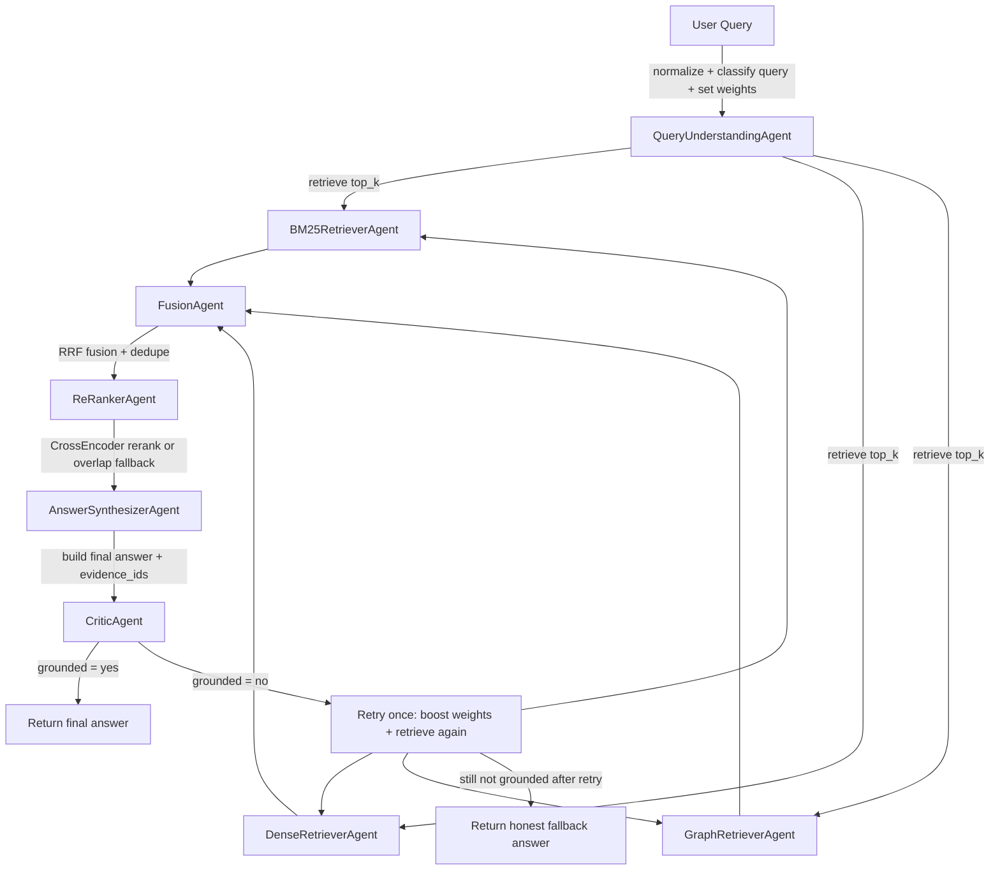

This file is a explanation of the components and structure for my own understanding and memory.
## For step1.ipynb
### Retrieval Techniques Overview
1. BM25 (Sparse Retrieval)
Mechanism: A statistical method that ranks documents based on keyword matching. It considers term frequency (how often a term appears in a document) and inverse document frequency (how rare a term is across the corpus), along with document length normalization.
Strengths: Fast, efficient, good for keyword-based queries, robust baseline.
Weaknesses: Lacks semantic understanding; struggles with synonyms, paraphrases, and contextual meaning.
2. Dense Retrieval (e.g., DPR, ColBERT, E5)
Mechanism: Uses neural networks (embedding models) to transform both queries and documents into dense numerical vectors (embeddings) in a high-dimensional space. Retrieval is then performed by finding documents whose embeddings are semantically closest to the query embedding.
Strengths: Excellent semantic understanding, captures context, handles synonyms and paraphrases effectively.
Weaknesses: Computationally more intensive (especially for embedding generation and vector search), requires robust vector indexing infrastructure.
3. Hybrid/Ensemble Retrieval
Mechanism: Combines multiple retrieval methods (e.g., BM25 and Dense Retrieval) to leverage the strengths of each. Often uses techniques like Reciprocal Rank Fusion (RRF) to merge and re-rank results from different retrievers.
Strengths: Often outperforms individual retrieval methods by combining lexical precision with semantic understanding; considered a best practice in many real-world systems.
Weaknesses: More complex to implement and manage than single-method approaches.
4. Re-ranking Models
Mechanism: Applied as a second stage after initial retrieval. A more powerful (and typically slower) neural model (e.g., a cross-encoder transformer) re-scores a smaller set of top-N candidates from the initial retrieval to refine their ranking based on deeper contextual relevance.
Strengths: Significantly improves precision and relevance at the top of the search results by applying advanced contextual understanding.
Weaknesses: Computationally expensive, only feasible for a small subset of initially retrieved documents.
5. Graph-based Retrieval (e.g., GraphRAG)
Mechanism: (As implemented in the notebook) Leverages a graph structure (e.g., a graph of document communities or relationships) to guide the retrieval process. It often involves a two-stage approach: first identifying relevant graph components (like communities), then scoring candidate documents within those components using semantic similarity.
Strengths: Can uncover relationships and contextual information, effective for grouping semantically related content.
Weaknesses: Can be complex to build and maintain the graph structure; not a traditional knowledge graph but rather a document-relationship graph for retrieval enhancement.
## For step2.ipynb

### The agents implemented are:
Query Understanding Agent: Analyzes the input query.
Retriever Agents: (BM25, Dense, GraphRAG) – Fetch relevant documents using different retrieval mechanisms.
Fusion Agent: Merges and deduplicates results from multiple retrievers.
Re-Ranker Agent: Re-ranks the fused documents for better relevance.
Answer Synthesizer Agent: Generates a final answer based on the re-ranked documents.
Critic Agent: Evaluates the generated answer for grounding and coherence, potentially triggering a re-retrieval if necessary.

### differences between step1 and step2

Step 1 mindset: “Which retriever performs best?”
Query → BM25 / Dense / GraphRAG / Hybrid / ReRank → metrics (P@k, Recall, MRR)

Step 2 mindset: “How should multiple agents collaborate?”
Query → QueryUnderstandingAgent → RetrieverAgents (BM25/Dense/GraphRAG) → FusionAgent → ReRankerAgent → AnswerSynthesizerAgent → CriticAgent (optional retry)

What is same vs different

Same (reused from Step 1):
Core retrieval techniques: BM25, Dense, GraphRAG
Fusion idea (RRF), reranking idea
Same data/artifacts and mostly same retrieval logic
Different (new in Step 2):
Retrieval is now put into Retriever Agent classes
Added non-retrieval agents:
QueryUnderstandingAgent
FusionAgent
ReRankerAgent
AnswerSynthesizerAgent
CriticAgent
Added shared state (AgentState) and pipeline logic (including retry when critic says low grounding)
Built for orchestration strategies later (parallel, confidence routing, etc.)
In one sentence Step 1 is about benchmarking retrieval methods; Step 2 is about turning those methods into a modular multi-agent system that can reason, combine, verify, and support smarter orchestration.

### Step2 code understanding (brief)

Main idea: Step2 reuses Step1 retrievers, but wraps them into agents and adds control logic (state, critic, retry).



Essential reading order in code:
1. `AgentState` (shared data object)
2. `QueryUnderstandingAgent` (query type + weights)
3. Retriever agents (`BM25`, `Dense`, `Graph`)
4. `FusionAgent` and `ReRankerAgent`
5. `AnswerSynthesizerAgent` and `CriticAgent`
6. `MultiAgentPipeline.run()` (full execution + retry flow)

### Step2 agents actions (separate step flow)

#### 0) Shared state (`AgentState`)
Flow: Query comes in -> agents read/write one shared object -> final answer is produced.

Essential code:
```python
@dataclass
class AgentState:
    query: str
    normalized_query: str = ''
    query_type: str = 'mixed'
    query_hints: Dict[str, float] = field(default_factory=dict)
    retrieval_by_agent: Dict[str, List[Any]] = field(default_factory=dict)
    fused_docs: List[Any] = field(default_factory=list)
    reranked_docs: List[Any] = field(default_factory=list)
    final_answer: str = ''
    critic_ok: bool = False
    needs_reretrieval: bool = False
```

That block defines AgentState, which is the shared memory object for the whole Step 2 pipeline.

Think of it like one “project folder” passed between agents.
Each agent reads some fields and updates others.

Flow

Initialize AgentState(query=...)
Query agent adds query understanding info
Retriever agents add retrieved docs
Fusion/rerank/answer agents add processed outputs
Critic agent adds quality decision flags
Pipeline decides final output / retry based on those flags
What each state field means
query: str
Original user question.
Used as base input for all later steps.
normalized_query: str
Cleaned version of query (trimmed, normalized spaces, etc.).
Used for more stable retrieval.
query_type: str
Category like keyword, semantic, entity_temporal, mixed.
Helps decide retriever weighting strategy.
query_hints: Dict[str, float]
Dynamic weights/hints (e.g. {'bm25':0.7, 'dense':1.1, 'graph':1.4}).
Used by fusion and retry logic.
retrieval_by_agent: Dict[str, List[Any]]
Stores raw retrieval outputs per agent (bm25, dense, graph).
Lets fusion combine them later.
fused_docs: List[Any]
Output after combining retriever results (RRF + dedupe).
“Merged candidate pool.”
reranked_docs: List[Any]
Output after reranking (CrossEncoder or fallback).
Better top-ranked docs for answer generation.
final_answer: str
The generated final text answer.
Can be normal answer or honest fallback message.
critic_ok: bool
Critic verdict: is answer sufficiently grounded?
True = accept answer, False = risky/weak grounding.
needs_reretrieval: bool
Control flag for retry.
If True, pipeline runs one more retrieval round with boosted weights.

#### 1) QueryUnderstandingAgent
Flow: Raw query -> normalize + classify query type + set retriever weights -> store hints in state.

Essential code:
```python
state.normalized_query = ' '.join(q.split())
state.query_type = q_type
state.query_hints.update({'bm25': 0.7, 'dense': 1.1, 'graph': 1.4})
```
e.g., trust graph most
then dense
trust bm25 least, in general adjusting 

Why it improves results: adapts retrieval to query type instead of using one fixed strategy.

#### 2) Retriever agents (BM25, Dense, GraphRAG)
Flow: Normalized query -> each retriever gets top_k -> results stored separately.

Essential code:
```python
state.retrieval_by_agent['bm25'] = _safe_unique(self.retriever.search(state.normalized_query, top_k=top_k))
state.retrieval_by_agent['dense'] = _safe_unique(self.retriever.search(state.normalized_query, top_k=top_k))
state.retrieval_by_agent['graph'] = _safe_unique(self.retriever.search(state.normalized_query, top_k=top_k, k_comms=48))
```
Line-by-line
state.retrieval_by_agent['bm25'] = ...
Run BM25 search on state.normalized_query
Keep top top_k docs
_safe_unique(...) removes duplicates / invalid IDs
Save into key 'bm25'
state.retrieval_by_agent['dense'] = ...
Same process, but using Dense retriever
Save into key 'dense'
state.retrieval_by_agent['graph'] = ...
Same process, but using Graph retriever
k_comms=48 means GraphRAG searches across more candidate communities before returning top docs
Save into key 'graph'
Why store this way?
retrieval_by_agent is a dictionary, so later FusionAgent can do:

take BM25 list
take Dense list
take Graph list
merge them with weighted fusion
So this block is basically: “collect evidence from 3 different search experts, keep them clean, and save by name for fusion.”

Why it improves results: combines complementary strengths (keyword, semantic, graph).

#### 3) FusionAgent
Flow: 3 retrieval lists -> weighted RRF fusion + deduplication -> fused list.

Essential code:
```python
runs = {'bm25': ..., 'dense': ..., 'graph': ...}
fused = _rrf_fuse(runs, weights=state.query_hints or None)
state.fused_docs = _safe_unique(fused)[:top_k]
```

What each line does
runs = {'bm25': ..., 'dense': ..., 'graph': ...}
Create one dictionary that holds three ranked result lists.
Each key is one retriever’s output.
fused = _rrf_fuse(runs, weights=state.query_hints or None)
Merge these ranked lists using RRF (Reciprocal Rank Fusion).
If state.query_hints has weights, use them (dynamic trust per retriever).
If no hints, use default weights.
Output is one combined ranking (fused).
state.fused_docs = _safe_unique(fused)[:top_k]
Remove duplicates / invalid doc IDs.
Keep only top top_k.
Save into state.fused_docs for next step (reranking).
Why this helps
Fusion is the “team voting” step:

BM25 contributes lexical precision,
Dense contributes semantic similarity,
Graph contributes relational/context links.

Why it improves results: documents supported by multiple retrievers are boosted.

1) What is RRF?
RRF = Reciprocal Rank Fusion.
It merges multiple ranked lists into one final ranking.

Simple intuition:

If a document appears high in multiple retrievers, it gets a strong combined score.
If it appears in only one retriever, it can still appear, but usually lower.
Typical form:

score(doc) += weight / (k_rrf + rank)
So RRF is a robust “multi-expert voting” method.

2) Why remove duplicates?
Same document can appear:

from BM25 and Dense and Graph at once, or
multiple times due to chunk/id inconsistencies.
If you don’t deduplicate:

one doc may occupy many positions unfairly,
diversity drops,
metrics and final answer quality can degrade.
So dedup keeps ranking fair and varied.

3) Why can invalid doc IDs happen?
A doc ID can be missing/invalid because:

metadata differences across artifacts (chunk_id, record_id, doc_id not always present),
loader/adaptor mismatch,
malformed or legacy objects,
serialization/deserialization inconsistencies.
Invalid IDs hurt fusion/evaluation because:

you cannot reliably track the same doc across retrievers,
qrels matching fails,
duplicates cannot be resolved correctly.
So invalid IDs are filtered out for stability.

4) Why keep only top K?
Because downstream steps are expensive and top-focused.

Re-ranker (CrossEncoder) is costly.
Answer synthesis should use best evidence, not hundreds of noisy docs.
Evaluation/reporting often measures top positions (P@k, MRR), so quality at the top matters most.
So top_k is a precision-efficiency tradeoff:

too small: miss useful docs,
too large: more noise + slower pipeline.

top_k means:

sort documents by score (highest to lowest), then
keep only the first k documents.

#### 4) ReRankerAgent
Flow: Fused docs -> CrossEncoder rerank (fallback to overlap rerank) -> top reranked docs.

Essential code:
```python
pairs = [(query, doc_text) for doc in docs[:50]]
scores = model.predict(pairs)
ranked = sorted(zip(candidates, scores), key=lambda x: float(x[1]), reverse=True)
state.reranked_docs = [d for d, _ in ranked[:top_k]]
```

Why it improves results: improves top-ranked precision before answer generation.

#### 5) AnswerSynthesizerAgent
Flow: Top docs -> score sentences (overlap + temporal bonus) -> compose answer + evidence ids.

Essential code:
```python
ctx = self._build_context(state.reranked_docs or state.fused_docs)
base = len(q_terms & st) / max(len(st), 1) * len(q_terms & st)
if year and re.search(r'\\b'+str(year)+r'\\b', s):
    base *= 2.5
state.final_answer = ' '.join(best)
```

Why it improves results: answer stays closer to retrieved evidence and handles time-based queries better.

#### 6) CriticAgent
Flow: Final answer + support docs -> grounding and temporal checks -> pass/fail decision.

Essential code:
```python
overlap = len(answer_terms & support_terms) / max(len(answer_terms), 1)
grounded = overlap >= min_support_overlap and per_doc_max >= 0.25
state.critic_ok = grounded and temporal_ok
state.needs_reretrieval = not state.critic_ok
```

Why it improves results: catches unsupported answers and triggers correction.

#### 7) Retry logic in `MultiAgentPipeline`
Flow: Critic fails -> boost weights + retrieve/fuse/rerank/synthesize again -> if still fail, return honest fallback.

Essential code:
```python
if retry_once and state.needs_reretrieval:
    boosted['bm25'] = boosted.get('bm25', 1.0) + 0.3
    boosted['dense'] = boosted.get('dense', 1.0) + 0.3

if not state.critic_ok:
    state.final_answer = 'The available corpus does not contain sufficient evidence...'
```

Why it improves results: gives one correction pass and avoids confident wrong answers.