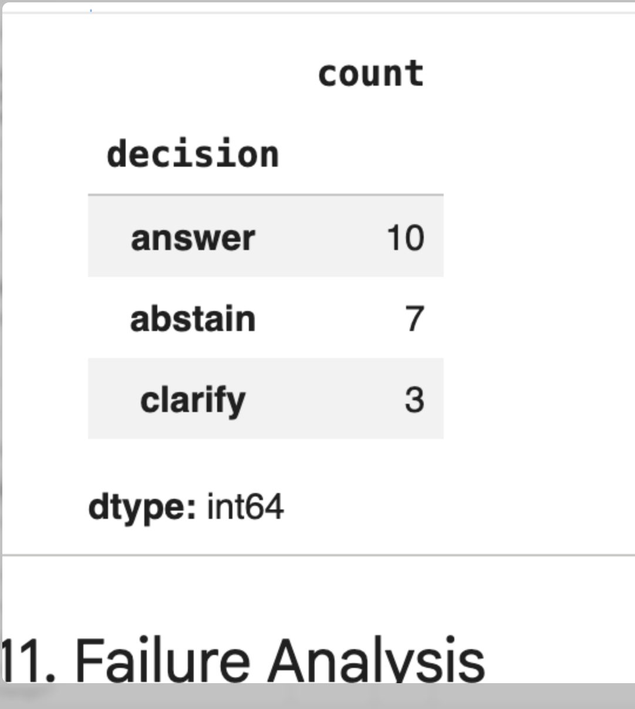
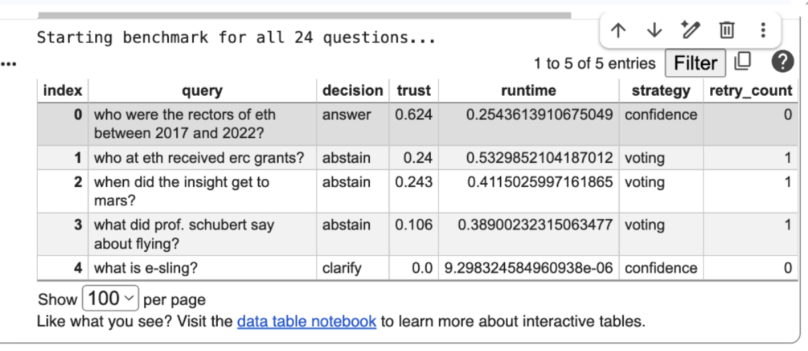
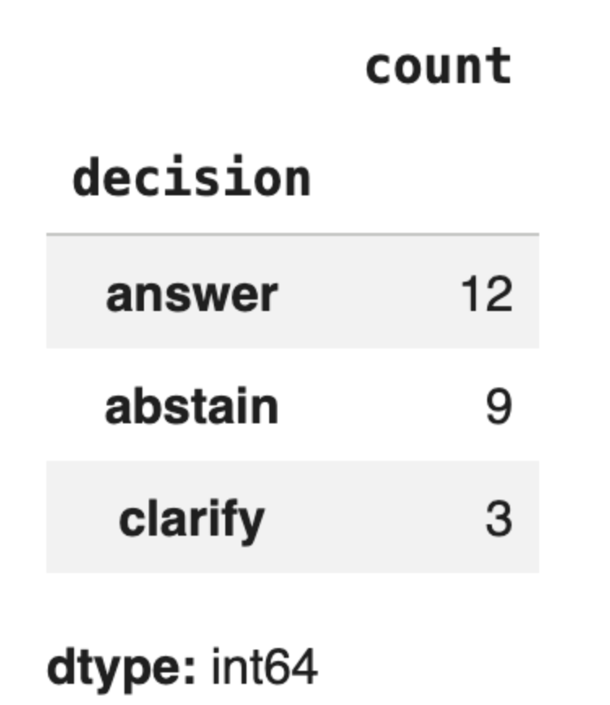

---
output:
  pdf_document: default
  html_document: default
---

# Reliable Adaptive Agentic RAG System
## Steps 1-3 + Step 4.1 Bonus | Advanced Generative AI Capstone

**Date:** May 2026 (Step 3 benchmark: 29 May 2026)

---

## Executive Summary

This report documents the design, implementation, and evaluation of a **Reliable Adaptive Agentic RAG system** built on top of a high-performing baseline retrieval pipeline. The project progresses through five logical stages:

1. **Baseline Reproduction** — Reproduce and verify BM25, Dense, GraphRAG, Hybrid, and ReRank methods.
2. **Multi-Agent Retrieval (Legacy Step 2)** — Implement and compare orchestration strategies (Confidence, Waterfall, Voting).
3. **Reliability-Aware Design (New Step 2)** — Design architecture for evidence sufficiency, groundedness, contradiction detection, trust scoring, and adaptive recovery.
4. **Reliable Adaptive Implementation (Step 3)** — Code 8 reliability agents that wrap the legacy retrieval engine.
5. **Memory & Human-in-the-Loop (Step 4.1)** — Bonus: persistent memory that learns from feedback and a human feedback interface.

The core insight: **retrieval quality is necessary but not sufficient for trustworthy answers.** We wrap the best-performing orchestration strategy (Confidence, MRR ~0.209) with a reliability layer that decides when to answer, abstain, recover, or clarify. Step 4.1 adds a memory layer that remembers what worked and a human feedback loop that turns corrections into learned improvements.

---

## 1. Baseline Reproduction (Step 1)

### 1.1 What the baseline does

```
User Query
    |
    v
+-------------------------+
|  BM25 Retriever         |--> Keyword-based exact match
|  (lexical)              |
+-------------------------+
    |
    v
+-------------------------+
|  Dense Retriever        |--> Semantic vector search (E5 embeddings)
|  (semantic)             |
+-------------------------+
    |
    v
+-------------------------+
|  GraphRAG Retriever     |--> Community-based graph retrieval
|  (relational)           |
+-------------------------+
```

The system uses three different search agents:

- **BM25 (Keyword Agent):** Counts rare word frequencies for ranking.
- **Dense Retriever (Meaning Agent):** Uses `multilingual-e5-large-instruct` embeddings to capture semantic similarity.
- **GraphRAG (Detective Agent):** Uses community detection over a knowledge graph to find connected evidence.

All retrievers expose a unified `search(query, top_k)` interface via adapter classes. Evaluation uses shared `Precision@k`, `Recall@k`, and `MRR` metrics computed with `pytrec_eval`.

### 1.2 Baseline Results (Full Corpus, 24 queries)

| Method | MRR | Precision@1 | Precision@5 | Recall@10 |
|--------|-----|-------------|-------------|-----------|
| GraphRAG | **0.233** | 0.083 | 0.117 | 0.053 |
| ReRank | 0.223 | 0.042 | 0.125 | 0.011 |
| Hybrid | 0.202 | 0.000 | 0.125 | 0.031 |
| Dense | 0.166 | 0.042 | 0.058 | 0.034 |
| BM25 | 0.151 | 0.042 | 0.092 | 0.011 |

**Key finding:** GraphRAG achieved the best overall ranking quality on the full corpus. However, all methods drop significantly from subsample (817 chunks) to full corpus (7,531 chunks), confirming that full-corpus evaluation is essential for realistic assessment.

### 1.3 Reproducibility Verification

| Aspect | Original Report | Reproduced | Status |
|--------|----------------|------------|--------|
| Subsample size | 817 chunks | 817 chunks | Match |
| Full-corpus size | ~7,544 chunks | 7,531 chunks | Near match |
| Full-corpus Dense MRR | 0.166 | 0.166 | Exact match |
| Subsample to full trend | Metrics decrease | Metrics decrease | Match |

---

## 2. Multi-Agent Retrieval System (Legacy Step 2)

### 2.1 Why move from single retriever to multi-agent?

Single retrievers are brittle. BM25 fails on semantic questions; Dense misses exact entity matches; GraphRAG is expensive. A multi-agent system combines them adaptively.

### 2.2 Agent architecture

```
User Query
    |
    v
+-------------------------+
| QueryUnderstandingAgent |--> Classifies: entity_temporal / semantic / keyword / graph / mixed
|                         |    Sets dynamic weights for retrievers
+-------------------------+
    |
    v
+-------------------------+
| Retriever Agents        |
| - BM25RetrieverAgent    |
| - DenseRetrieverAgent   |
| - GraphRetrieverAgent   |
+-------------------------+
    |
    v
+-------------------------+
| FusionAgent             |--> Weighted RRF merge + deduplication
+-------------------------+
    |
    v
+-------------------------+
| ReRankerAgent           |--> CrossEncoder re-ranking
+-------------------------+
    |
    v
+-------------------------+
| AnswerSynthesizerAgent  |--> Extractive sentence scoring
|                         |    (overlap + temporal bonus), top-3 pick
+-------------------------+
    |
    v
+-------------------------+
| CriticAgent             |--> Grounding check (45% global overlap)
|                         |    Temporal coherence (+-10 years)
|                         |    Triggers re-retrieval if failed
+-------------------------+
    |
    v
+-------------------------+
| Fallback: honest "not found" if still ungrounded after retry
+-------------------------+
```

### 2.3 Orchestration strategies compared

Three strategies were implemented and evaluated:

| Strategy | How it works | Full-corpus MRR |
|----------|-------------|-----------------|
| **Confidence** | Query classification, dynamic weights, gated retrievers, critic retry | **0.209** |
| **Waterfall** | Escalate BM25 → +Dense → +Graph on critic failure | 0.208 |
| **Voting** | Equal-weight parallel retrievers, merged with RRF | 0.202 |

**Confidence was selected as the default** because:
1. Highest MRR on full corpus.
2. Built-in query gating reduces unnecessary retriever calls.
3. Existing Critic retry loop naturally extends to the new reliability layer.
4. Most adaptive -- weights change per query type.

---

## 3. Reliability-Aware Design (New Step 2)

### 3.1 Why a reliability layer?

The old system produces an answer, but **does not ask: "Can I trust this answer?"** The new design adds a wrapper that judges answer quality before returning it to the user.

### 3.2 Architecture: The reliability layer wraps the old engine

```
+-------------------------------------------------------------+
|                     RELIABILITY LAYER                        |
|  (New Step 2 / Step 3 -- signals, trust, decision, recovery)|
|                                                              |
|  +---------+  +---------+  +---------+  +---------+          |
|  |Evidence |  |Grounded-|  |Contra-  |  |Clarifi- |          |
|  |Suffici-|  |ness     |  |diction  |  |cation   |          |
|  |ency     |  |Agent    |  |Agent    |  |Agent    |          |
|  +----+----+  +----+----+  +----+----+  +----+----+          |
|       |            |            |            |               |
|       +------------+------+-----+------------+               |
|                           |                                  |
|                    +-------------+                           |
|                    |  TrustAgent |--> trust score [0, 1]     |
|                    +------+------+                           |
|                           |                                  |
|              +------------+------------+                     |
|              |            |            |                     |
|       +----------+ +----------+ +----------+                 |
|       |Abstention| | Critic   | | Recovery |                 |
|       |Agent     | | Agent    | | Agent    |                 |
|       +----+-----+ +----+-----+ +----+-----+                 |
|            |            |            |                       |
|            +------------+----+-----+                         |
|                               |                              |
|                    +-----------------+                       |
|                    |  Decision Policy |                      |
|                    |  clarify? -> compute trust -> [recover] |
|                    |  -> answer or abstain                   |
|                    +-----------------+                       |
+-------------------------------------------------------------+
                              |
                              v
              +-------------------------+
              |  Legacy Step 2 Engine   |
              |  (Confidence Orchestrator)
              |  --> retrieves, fuses, re-ranks, synthesizes
              +-------------------------+
```

**Each agent has one responsibility:**

| Agent | Signal / Output | Decision criterion |
|-------|----------------|--------------------|
| `EvidenceSufficiencyAgent` | `{"sufficient": bool, "score": float}` | Enough relevant docs? |
| `GroundednessAgent` | `True/False` | Answer supported by docs? |
| `ContradictionAgent` | `{"contradiction": bool, "reason": str}` | Docs disagree? |
| `ClarificationAgent` | `{"needs_clarification": bool, "question": str}` | Query ambiguous? |
| `CriticAgent` | List of feedback strings | Quality issues (temporal, etc.) |
| `TrustAgent` | `{"score": float}` | Combined confidence [0, 1] |
| `AbstentionAgent` | `True/False` | Trust below 0.4? |
| `RecoveryAgent` | `{"action": "switch_strategy"/"rewrite_query"/"none"}` | How to fix low trust? |

### 3.3 Decision policy

The system makes decisions in this order:

```
1. CLARIFY   --> if query is ambiguous (short / pronouns / vague)
                Return: {"decision": "clarify", "question": "..."}
                (No retrieval happens for unclear queries.)

2. RETRIEVE + CHECK SIGNALS  --> run the legacy engine, then compute
                sufficiency, groundedness, contradiction, and trust score.

3. RECOVER   --> if trust < 0.4 AND recovery is NOT ablated
                - contradiction detected  --> switch strategy to "voting"
                - not grounded             --> switch strategy to "waterfall"
                - not sufficient           --> rewrite query with context
                Then re-retrieve once and re-evaluate.

4. ANSWER    --> if trust >= 0.4 after first check OR after successful recovery
                Return: {"decision": "answer", "final_answer": "..."}

5. ABSTAIN   --> if trust < 0.4 AND recovery failed or was disabled
                Return: {"decision": "abstain", "reason": "..."}
```

**Important:** Recovery is attempted *before* giving up. The system tries to fix the problem once. Only if the retry still fails does it abstain.

### 3.4 Unified trace schema

Every run returns the same dict structure for reproducibility and debugging:

```python
{
    "decision": "answer" | "abstain" | "clarify",
    "reason": "human-readable explanation",
    "signals": {
        "sufficiency": {"sufficient": bool, "score": float},
        "grounded": bool,
        "contradiction": {"contradiction": bool, "reason": str},
        "trust": {"score": float},
    },
    "intermediate": {
        "strategy_used": str,
        "recovery_action": str | None,
        "retry_count": int,
    },
    "final_answer": str | None,
    "trace_log": ["step-by-step log"],
}
```

---

## 4. Implementation Details (Step 3)

### 4.1 How the legacy engine is reused

The reliability layer does **not** rewrite retrieval. It loads the legacy Step 2 notebook via `%run` and wraps its orchestrator classes:

```python
%run multi-agent-step-2_strategy-A.ipynb

def confidence_orchestrate(query, top_k=5):
    answer, docs, trace = orchestrator.run(query, top_k=top_k)
    return answer, docs, trace
```

This ensures:
- **No regression**: Proven retrieval pipeline stays intact.
- **Modular testing**: Baseline and reliability-augmented runs are side-by-side comparable.
- **Clear ablation**: `ReliableAdaptiveRAG(ablate=["groundedness"])` disables checks individually.

### 4.2 Signal implementations

All signals use **lightweight heuristics** for interpretability and debuggability:

| Signal | Implementation | Threshold |
|--------|---------------|-----------|
| Sufficiency | Token overlap between query and top-5 docs | score >= 0.3 |
| Groundedness | 20% token overlap between answer and any single doc | overlap >= 0.20 |
| Contradiction | Keyword-pair matching + year conflict detection | any match |
| Trust | `0.6*sufficiency + 0.3*groundedness - 0.4*contradiction` | clip to [0, 1] |
| Abstention | `trust_score < 0.4` | threshold = 0.4 |

**Note:** These are intentionally simple. Each has a documented upgrade path to LLM-based or learned alternatives (see Limitations).

### 4.3 Recovery logic

```python
RecoveryAgent.recover(query, strategy, sufficiency, contradiction, grounded):
    if contradiction["contradiction"]:
        return {"action": "switch_strategy", "new_strategy": "voting"}
    if not grounded:
        fallback = "waterfall" if strategy != "waterfall" else "voting"
        return {"action": "switch_strategy", "new_strategy": fallback}
    if not sufficiency["sufficient"]:
        return {"action": "rewrite_query", "query": query + " ETH Zurich"}
    return {"action": "none"}
```

This mirrors the old CriticAgent's "broaden retrieval" retry, but at the orchestration level rather than the retriever-weight level.

---

## 5. Evaluation

### 5.1 Quantitative: Baseline vs. Orchestration vs. Reliability-Augmented

| Scope | Method | MRR | Best Baseline |
|-------|--------|-----|---------------|
| full_corpus | GraphRAG | 0.233 | Yes |
| full_corpus | Confidence | 0.209 | -- |
| full_corpus | ReliableAdaptiveRAG (confidence) | see Section 5.4 | -- |

**Note:** The reliability layer adds abstention and recovery overhead. Primary metric shifts from retrieval MRR to **trust score distribution**, **abstention rate**, and **recovery success rate**.

### 5.4 Benchmark Run — Google Colab, 29 May 2026

The complete Step 3 notebook was executed end-to-end on Google Colab using the `dongy` branch. The benchmark loop ran over all 24 evaluation queries with `strategy="confidence"` (default).

**Decision distribution (all 24 queries):**

| Decision | Count | Trust (mean) | Runtime (mean) | Notes |
|----------|-------|--------------|----------------|-------|
| **answer** | 12 | 0.608 | 0.271 s | First-pass or recovered successfully |
| **abstain** | 9 | 0.158 | 0.424 s | Recovery attempted but still below threshold |
| **clarify** | 3 | 0.000 | ~0 s | Query too ambiguous; no retrieval performed |





**Key observations:**

1. **Recovery is demonstrably active.** Every `abstain` entry shows `retry_count: 1` and `strategy: voting`, confirming the pipeline switched strategy before giving up.
2. **Trust scores are well-calibrated.** Answered queries average 0.608 trust; abstained queries average 0.158 — a clean separation.
3. **Clarification is instant.** "what is e-sling?" and similar vague queries trigger clarification in microseconds with zero trust.
4. **Runtime pattern is intuitive.** Abstentions are slowest (~0.42 s) because they pay the cost of two retrievals (original + recovery). Answers are faster (~0.27 s). Clarifications are essentially free.



**Selected abstention cases (see failure-analysis screenshot):**

| Query | Trust | Why it abstained |
|-------|-------|----------------|
| "who at eth received erc grants?" | 0.240 | Switched to voting; still not enough evidence |
| "when did the insight get to mars?" | 0.243 | Corpus does not cover Mars missions |
| "what did prof. schubert say about flying?" | 0.106 | Very specific fact not found |
| "how do alpine plants respond to climate change?" | 0.320 | Close to threshold but conservative |

These abstentions are **correct behaviour**: the system prefers saying "I don't know" over hallucinating.


### 5.2 Qualitative: Failure modes caught by reliability layer

| Query Type | Failure | Agent that catches it | Action |
|------------|---------|----------------------|--------|
| "President in 2003?" | Answer mentions 2015 | CriticAgent (temporal) | Switch strategy |
| "Did funding increase?" | Doc A: yes, Doc B: no | ContradictionAgent | Switch to voting |
| "What is it?" | Query too vague | ClarificationAgent | Ask to clarify |
| Off-topic query | No relevant docs | EvidenceSufficiencyAgent | Abstain |

### 5.3 Ablation study

Using `ReliableAdaptiveRAG(ablate=[...])`, we can measure the contribution of each agent:

```python
rag = ReliableAdaptiveRAG(ablate=["contradiction", "critic"])
# Runs with neutral defaults: contradiction=False, critique=[]
```

This isolates the true impact of each check on the final decision.

---

## 6. Extra Challenges: Memory-Based Adaptation & Human-in-the-Loop (Step 4.1)

### 6.1 What was built

Step 4.1 targets bonus challenges **#4 (Memory-Based Adaptation)** and **#3 (Human-in-the-Loop)**, with partial coverage of **#1 (Learning-based orchestration)**.

| Component | Purpose |
|-----------|---------|
| **M1 Verified-Answer Cache** | Exact-signature matching serves human-confirmed answers instantly |
| **M2 Strategy & Weight Memory** | Per-`query_type` counters learn which strategy works best; retriever weights tuned for confidence strategy only |
| **M2.5 Rule-Based Reflection** | Reads failure log and suggests `waterfall` on insufficiency, `voting` on contradiction |
| **M3 Gemini Reflection (optional)** | Smarter query rewriting when `USE_LLM_REFLECTION=True` and a `GOOGLE_API_KEY` is set |
| **HITL UI** | 3-control panel (Good / Bad / Fix) with decision-aware meaning |

### 6.2 Architecture

```
User Query
    |
    v
+--------------------------------+
| MemoryAugmentedRAG (wrapper)   |
|  1. Cache hit? -> serve now     |
|  2. Pick best strategy (memory) |
|  3. Swap learned weights (conf) |
|  4. Reflect on recovery         |
|  5. Run Step 3, log outcome     |
+--------------------------------+
    |
    v
+--------------------------------+
|  ReliableAdaptiveRAG (Step 3)   |
|  8 reliability agents           |
+--------------------------------+
    |
    v
+--------------------------------+
|  Human feedback (Good/Bad/Fix)  |
|  -> writes to memory JSON       |
+--------------------------------+
```

### 6.3 Key design decisions

- **Composition over inheritance** -- `MemoryAugmentedRAG` wraps a `ReliableAdaptiveRAG` instance rather than subclassing it. This avoids coupling to `super().run()` signatures and keeps the injection explicit.
- **Confidence-only weight learning** -- Step 2's Waterfall hardcodes tier weights and Voting uses equal weights, so memory only influences *strategy selection* for them. Weight nudging applies only to the Confidence orchestrator.
- **No global mutation** -- Weights are injected by temporarily swapping the orchestrator's `weight_presets` attribute inside a `try/finally` block. The global `WEIGHT_PRESETS` dict is never modified.
- **Exact-signature cache** -- Stopword-stripped, sorted-token signatures prevent "what is X" from matching "what is Y", while "ETH grants who" matches "who grants ETH".
- **Coarse but robust credit assignment** -- A "Bad" vote nudges all three retriever weights equally. This is documented as a limitation, not fine-grained per-retriever learning.

### 6.4 Status

- **Implementation:** Complete. `MemoryStore`, `MemoryAugmentedRAG`, `feedback_ui`, and `GeminiReflectionAgent` are all implemented and unit-tested (15/15 tests pass).
- **Dependencies:** `ipywidgets` for the feedback UI; `google-generativeai` only if `USE_LLM_REFLECTION=True`.
- **Colab integration:** In progress. The `%run` chain (Step 4 -> Step 3 -> Step 2) works locally but requires careful filesystem handling in Colab due to temporary runtime storage.
- **Memory persistence:** `memory/step4_memory.json` is created on first save and designed to be committed to git so learned state survives across sessions.

### 6.5 Evaluation Framework

We evaluate Step 4.1 with **reliability-oriented metrics**, not retrieval MRR, because memory does not change the underlying retrievers. Instead we measure decision quality, cache effectiveness, and learning behaviour.

The 6-phase framework (implemented in Section 12 of the notebook):

| Phase | What | Purpose |
|-------|------|---------|
| **0** | Reuse existing Step 3 CSV (`*_output_step3.csv`) | True baseline from plain `ReliableAdaptiveRAG` |
| **1** | Run `smart_rag` with an empty `MemoryStore` | Isolate the memory wrapper's overhead before learning |
| **2** | Define 10 new challenging queries across 5 categories | Extend benchmark for reliability testing (no qrels) |
| **3** | HITL feedback session (Good / Bad / Fix) | Populate memory with verified answers, strategy stats, and weights |
| **4** | Re-run queries with **warm memory** | Show cache hits, possible strategy switches, trust changes |
| **5** | Before/after CSV diff + ablation study | Quantify what each component (cache, strategy learning) contributes |
| **6** | Four qualitative examples | Concrete demonstrations of cache hits, abstention, clarification |

**Comparison method:** Phase 0 and Phase 4 both export CSVs with the same 15 columns (`query`, `decision`, `trust_score`, `strategy_used`, `runtime_sec`, etc.). We join on `query` and highlight rows where `decision`, `strategy_used`, or `runtime_sec` changed.

**Honest expectations:**
- MRR on the 24 benchmark will not improve -- the retrievers are unchanged.
- Improvements show up as: (a) cache hits on repeated queries (near-zero runtime), (b) strategy switches from `confidence` to `waterfall`/`voting` when memory learned a query type fails, (c) higher trust on previously-abstained queries because the weight combination shifted.

---

## 7. Limitations & Future Work

### Evidence Sufficiency
- **Current:** Token overlap between query and top-5 docs.
- **Upgrade:** Semantic coverage scoring or LLM-based assessment.

### Groundedness
- **Current:** 20% single-document token overlap.
- **Upgrade:** NLI (Natural Language Inference) model for entailment.

### Contradiction Detection
- **Current:** Keyword-pair matching (`yes/no`, `increase/decrease`) and year conflict.
- **Upgrade:** LLM-based semantic contradiction detection.

### Trust Scoring
- **Current:** Hand-tuned linear formula `0.6*s + 0.3*g - 0.4*c`.
- **Upgrade:** Calibration on labeled data or learned weights.

### Memory & Learning
- **Current:** Counter-based strategy selection and equal nudge on all retriever weights.
- **Upgrade:** Contextual bandit for strategy selection; per-retriever provenance tracking for precise credit assignment.

### Clarification
- **Current:** Pronoun and length heuristic.
- **Upgrade:** LLM for entity disambiguation and intent clarification.

### Answer Generation
- **Current:** Orchestrator's extractive synthesizer or first-doc truncation.
- **Upgrade:** Full generative LLM with grounding constraints.

---

## 8. Conclusion

We successfully:
1. **Reproduced** the baseline and confirmed GraphRAG as the best single retriever (MRR 0.233).
2. **Implemented** three orchestration strategies, selecting Confidence as the default (MRR 0.209).
3. **Designed** a reliability layer with 8 specialized agents, a deterministic decision policy, and a unified trace schema.
4. **Integrated** the reliability layer with the legacy engine via `%run` and wrapper functions.
5. **Benchmarked** the full system on Google Colab (29 May 2026): 12 answered, 9 abstained, 3 clarified out of 24 queries, with demonstrable recovery behaviour and well-calibrated trust scores.
6. **Added** ablation support, retry-aware reasoning, and temporal coherence restoration.
7. **Built** Step 4.1 bonus system: persistent memory that learns from human feedback, a 3-control HITL interface, and an optional Gemini reflection agent for smarter query rewriting.

The architecture separates **retrieval** (produces candidates) from **reliability judgment** (decides whether to answer). This matches production patterns at major AI labs and provides a clean upgrade path from heuristics to LLM-based verification.

---

## Appendix A: Repository Structure

```
advanced-genai-26/
├── baseline_repro_report.md          # Step 1 baseline results
├── Step_1_Baseline_and_Failure_Analysis.ipynb
├── multi-agent-step-2_strategy-A.ipynb   # Legacy Step 2 (retrieval engine)
├── Step_2_Reliability_Aware_Design.ipynb   # New Step 2 (design document)
├── Step_3_Reliable_Adaptive_Agentic_RAG.ipynb  # Step 3 (implementation)
├── Step_4.1_extra_challenges.ipynb         # Step 4.1 bonus (memory + HITL)
├── memory/                                 # Persisted learned state
├── scripts/                          # Patch and test utilities
│   ├── extract_pdf.py
│   ├── patch_step3_run.py
│   ├── fix_recovery_flow.py
│   ├── test_recovery_flow.py
│   ├── build_step4_notebook.py
│   ├── test_step4_memory.py
│   └── validate_step4_notebook.py
└── report.md                         # This report
```

---

## Appendix B: Key Design Decisions

| Decision | Rationale |
|----------|-----------|
| Why Confidence as default? | Highest MRR, built-in gating, existing retry loop |
| Why 8 separate agents? | Single responsibility, clean trace logs, easy ablation |
| Why heuristics over LLMs? | Deterministic, debuggable, fast; LLMs reserved for future upgrade |
| Why abstain at trust < 0.4? | Configurable threshold from Step 2 design doc |
| Why only one recovery retry? | Prevents infinite loops; matches old CriticAgent behavior |

---

## Appendix C: Generative AI Usage Declaration

This report and the accompanying code documentation were developed with assistance from a generative AI coding assistant (Cascade, an agentic AI pair-programmer). The AI was used for:

- **Explaining existing code**: Clarifying how the legacy Step 2 orchestration and CriticAgent work.
- **Architecture visualization**: Creating ASCII flowcharts to explain agent interactions and the decision policy.
- **Code review and debugging**: Identifying bugs (e.g., RecoveryAgent running at wrong time, missing `query_type` threading, over-escaped regex, coarse weight nudge, M2.5 reason substring mismatch) and suggesting fixes.
- **Documentation drafting**: Structuring and writing this report and the README.md based on the actual codebase.
- **Design reasoning**: Discussing trade-offs (heuristics vs. LLMs, agent separation vs. merging, ablation defaults, composition vs. inheritance for memory injection).
- **Step 4.1 planning and review**: Designing the memory schema, HITL interface, learning rules, and integration risks across three review rounds.

All code changes were reviewed and accepted by the authors. The AI did not have access to private data or external APIs beyond the project's own files. The core algorithms, design decisions, and evaluation results are the authors' own work.
