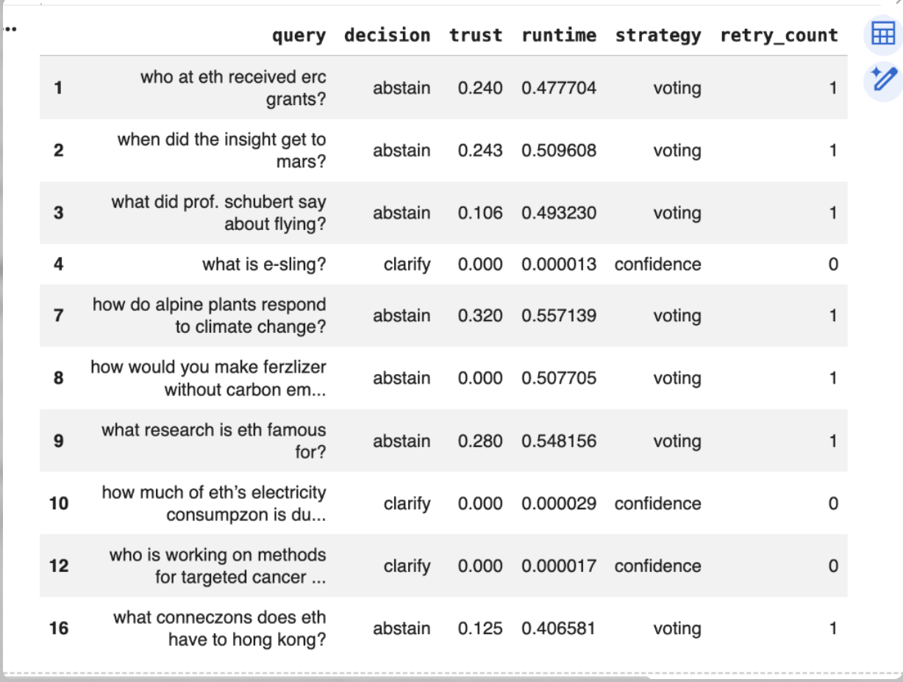
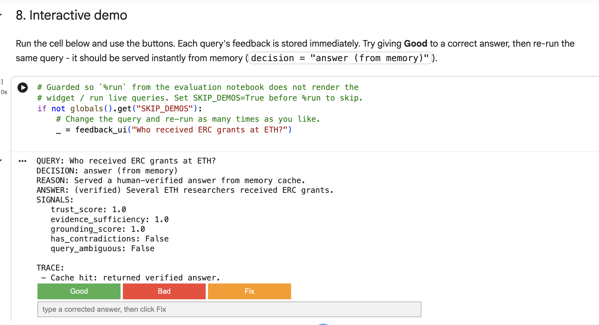

# Reliable Adaptive Agentic RAG System
## Steps 1-3 + Step 4.1 Bonus | Advanced Generative AI Capstone

**Date:** May 2026 (Step 3 benchmark: 29 May 2026)


## Executive Summary

We built a **Reliable Adaptive Agentic RAG system** on top of a high-performing baseline retrieval pipeline. The project moves through five stages:

1. **Baseline Reproduction** --- Reproduce and verify BM25, Dense, GraphRAG, Hybrid, and ReRank methods.
2. **Multi-Agent Retrieval (Legacy Step 2)** --- Implement and compare orchestration strategies (Confidence, Waterfall, Voting).
3. **Reliability-Aware Design (New Step 2)** --- Design architecture for evidence sufficiency, groundedness, contradiction detection, trust scoring, and adaptive recovery.
4. **Reliable Adaptive Implementation (Step 3)** --- Code 8 reliability agents that wrap the legacy retrieval engine.
5. **Memory & Human-in-the-Loop (Step 4.1)** --- Bonus: persistent memory that learns from feedback and a human feedback interface.

The core insight: **retrieval quality is necessary but not sufficient for trustworthy answers.** We wrap the best-performing orchestration strategy (Confidence, MRR ~0.209) with a reliability layer that decides when to answer, abstain, recover, or clarify. Step 4.1 adds a memory layer that remembers what worked and a human feedback loop that turns corrections into learned improvements.


## 1. Baseline Reproduction (Step 1)

### 1.1 What the baseline does

\footnotesize

```
User Query
    |
    v
+-------------------------+
|  BM25 Retriever         |--> Keyword-based exact match
|  (lexical)              |
+-------------------------+
    |
    v
+-------------------------+
|  Dense Retriever        |--> Semantic vector search (E5 embeddings)
|  (semantic)             |
+-------------------------+
    |
    v
+-------------------------+
|  GraphRAG Retriever     |--> Community-based graph retrieval
|  (relational)           |
+-------------------------+
```

\normalsize

The system uses three different search agents:

- **BM25 (Keyword Agent):** Counts rare word frequencies for ranking.
- **Dense Retriever (Meaning Agent):** Uses `multilingual-e5-large-instruct` embeddings to capture semantic similarity.
- **GraphRAG (Detective Agent):** Uses community detection over a knowledge graph to find connected evidence.

All retrievers expose a unified `search(query, top_k)` interface via adapter classes. Evaluation uses shared `Precision@k`, `Recall@k`, and `MRR` metrics computed with `pytrec_eval`.

### 1.2 Baseline Results (Full Corpus, 24 queries)

| Method | MRR | Precision@1 | Precision@5 | Recall@10 |
|--------|-----|-------------|-------------|-----------|
| GraphRAG | **0.233** | 0.083 | 0.117 | 0.053 |
| ReRank | 0.223 | 0.042 | 0.125 | 0.011 |
| Hybrid | 0.202 | 0.000 | 0.125 | 0.031 |
| Dense | 0.166 | 0.042 | 0.058 | 0.034 |
| BM25 | 0.151 | 0.042 | 0.092 | 0.011 |

**Key finding:** GraphRAG achieved the best overall ranking quality on the full corpus. The reported Step 1 workflow uses the full-corpus setting only, because it is the realistic evaluation condition for the project.

### 1.3 Reproducibility Verification

| Aspect | Original Report | Reproduced | Status |
|--------|----------------|------------|--------|
| Full-corpus size | ~7,544 chunks | 7,531 chunks | Near match |
| Full-corpus Dense MRR | 0.166 | 0.166 | Exact match |

The Step 1 notebook still contains legacy compatibility code for older artifact formats, but the active reported configuration is fixed to `EVAL_SCOPE = "full_corpus"`.

### 1.4 Failure Taxonomy from Step 1

The Step 1 notebook also performs a structured failure analysis for the same reference baseline: `Confidence` orchestration on the full corpus. The taxonomy is heuristic and should be interpreted as diagnostic evidence rather than absolute ground truth, because it uses retrieval position, answer/gold overlap, and lightweight proxy signals.

| Failure Type | Count |
|--------------|-------|
| `synthesis_failure` | 10 |
| `retrieval_failure` | 8 |
| `ranking_failure` | 5 |
| `overconfidence_failure` | 4 |
| `orchestration_failure` | 1 |
| `contradiction_failure` | 1 |

The table shows that the largest problems are not only retrieval misses, but also answer synthesis and overconfident generation. In several cases, relevant evidence exists but the generated answer focuses on the wrong detail or produces a weak match to the gold answer. In other cases, relevant evidence is missing from the retrieved context, yet the system still produces a fluent answer. These observations motivate the reliability layer in Steps 2-4: evidence sufficiency checks, groundedness checks, contradiction handling, trust scoring, abstention, critique, and recovery.


## 2. Multi-Agent Retrieval System (Legacy Step 2)

### 2.1 Why move from single retriever to multi-agent?

Single retrievers are brittle. BM25 fails on semantic questions; Dense misses exact entity matches; GraphRAG is expensive. A multi-agent system combines them adaptively.

### 2.2 Agent architecture

\footnotesize

```
+--------+    +----------+    +----------+    +--------+
| Query  |--->|  Parse   |--->|Retrievers|--->| Fusion |
| (user) |    |(classify)|    |{BM25|D|G}|    | (RRF)  |
+--------+    +----------+    +----------+    +---+----+
                                                  |
+--------+    +----------+    +----------+     +---v----+
| Output |<---|  Critic  |<---| Synthesize|<---|ReRank  |
|ans/abs |    | (ground) |    | (extract) |    |(X-Enc) |
+--------+    +----------+    +----------+     +--------+
```

\normalsize

### 2.3 Orchestration strategies compared

Three strategies were implemented and evaluated:

| Strategy | How it works | Full-corpus MRR |
|----------|-------------|-----------------|
| **Confidence** | Query classification, dynamic weights, gated retrievers, critic retry | **0.209** |
| **Waterfall** | Escalate BM25 -> +Dense -> +Graph on critic failure | 0.208 |
| **Voting** | Equal-weight parallel retrievers, merged with RRF | 0.202 |

**Confidence was selected as the default** because:
1. Highest MRR on full corpus.
2. Built-in query gating reduces unnecessary retriever calls.
3. Existing Critic retry loop naturally extends to the new reliability layer.
4. Most adaptive --- weights change per query type.

Orchestration improves retrieval coverage, but it never asks: "Is this answer actually correct?" The system answers blindly. We need a reliability layer that judges answer quality before returning it to the user.


## 3. Reliability-Aware Design (New Step 2)

### 3.1 Why a reliability layer?

The old system produces an answer, but **does not ask: "Can I trust this answer?"** The new design adds a wrapper that judges answer quality before returning it to the user.

### 3.2 Architecture: The reliability layer wraps the old engine

\footnotesize

```
+--------------------------------------------------------------------------+
|                       RELIABILITY LAYER ( Step 3 )                       |
|  +----------+  +--------------+  +----------------+  +----------------+  |
|  | Evidence |  | Groundedness |  | Contradiction  |  | Clarification  |  |
|  +-----+----+  +-------+------+  +--------+-------+  +--------+-------+  |
|        +--------------+---------|---------+------------------+           |
|                         +---------------+                                |
|                         |  TrustAgent   |  -->  trust score [0, 1]       |
|                         +-------|-------+                                |
|              +------------------+------------------+                     |
|     +------------------+ +--------------+ +------------------+           |
|     | Abstention Agent | | Critic Agent | |  Recovery Agent  |           |
|     +---------+--------+ +-------+------+ +---------+--------+           |
|               +------------------+------------------+                    |
|                                 |                                        |
|  +------------------------------+     +------------------------+         |
|  |        Decision Policy       |     |   Legacy Step 2        |         |
|  |  clarify -> trust -> recover |     | (Conf. Orchestrator)   |         |
|  |  -> answer/abstain           | <-> |  retrieve -> fuse      |         |
|  |                              |     |   -> re-rank -> synth  |         |
|  +------------------------------+     +------------------------+         |                         |
+--------------------------------------------------------------------------+
|                                               

```

\normalsize

**Each agent has one responsibility:**

| Agent | Output | Criterion |
|-------|--------|-----------|
| `EvidenceSufficiencyAgent` | `bool, score` | Enough relevant docs? |
| `GroundednessAgent` | `bool` | Answer supported by docs? |
| `ContradictionAgent` | `bool, reason` | Docs disagree? |
| `ClarificationAgent` | `bool, question` | Query ambiguous? |
| `CriticAgent` | Feedback list | Quality issues (temporal, etc.) |
| `TrustAgent` | `score: float` | Combined confidence [0, 1] |
| `AbstentionAgent` | `bool` | Trust below 0.4? |
| `RecoveryAgent` | `action: switch/rewrite/none` | How to fix low trust? |

### 3.3 Decision policy

The system makes decisions in this order:

| Step | Condition | Action |
|------|-----------|--------|
| **1. Clarify** | Query is ambiguous (short / pronouns / vague) | Return clarification question; no retrieval |
| **2. Retrieve + Check** | Run legacy engine, compute signals | Sufficiency, groundedness, contradiction, trust |
| **3. Recover** | Trust < 0.4 and recovery enabled | Switch strategy or rewrite query; re-retrieve once |
| **4. Answer** | Trust >= 0.4 (first check or after recovery) | Return final answer |
| **5. Abstain** | Trust < 0.4 and recovery failed / disabled | Return abstention with reason |

**Important:** Recovery is attempted *before* giving up. The system tries to fix the problem once. Only if the retry still fails does it abstain.

### 3.4 Unified trace schema

Every run returns the same dict structure for reproducibility and debugging:

\footnotesize

```python
{
    "decision": "answer" | "abstain" | "clarify",
    "reason": "human-readable explanation",
    "signals": {
        "sufficiency": {"sufficient": bool, "score": float},
        "grounded": bool,
        "contradiction": {"contradiction": bool, "reason": str},
        "trust": {"score": float},
    },
    "intermediate": {
        "strategy_used": str,
        "recovery_action": str | None,
        "retry_count": int,
    },
    "final_answer": str | None,
    "trace_log": ["step-by-step log"],
}
```

\normalsize

With the architecture defined, we now turn to implementation: building each agent, wiring them together, and preserving the legacy retrieval pipeline unchanged.


## 4. Implementation Details (Step 3)

### 4.1 How the legacy engine is reused

The reliability layer does **not** rewrite retrieval. It loads the legacy Step 2 notebook via `%run` and wraps its orchestrator classes:

```python
%run multi-agent-step-2_strategy-A.ipynb

def confidence_orchestrate(query, top_k=5):
    answer, docs, trace = orchestrator.run(query, top_k=top_k)
    return answer, docs, trace
```

This ensures three properties:

- **No regression**: Proven retrieval pipeline stays intact.
- **Modular testing**: Baseline and reliability-augmented runs are side-by-side comparable.
- **Clear ablation**: `ReliableAdaptiveRAG(ablate=["groundedness"])` disables checks individually.

### 4.2 Signal implementations

All signals use **lightweight heuristics** for interpretability and debuggability:

| Signal | Implementation | Threshold |
|--------|---------------|-----------|
| Sufficiency | Token overlap between query and top-5 docs | score >= 0.3 |
| Groundedness | 20% token overlap between answer and any single doc | overlap >= 0.20 |
| Contradiction | Keyword-pair matching + year conflict detection | any match |
| Trust | `0.6*sufficiency + 0.3*groundedness - 0.4*contradiction` | clip to [0, 1] |
| Abstention | `trust_score < 0.4` | threshold = 0.4 |

**Note:** These are intentionally simple. Each has a documented upgrade path to LLM-based or learned alternatives (see Limitations).

### 4.3 Recovery logic

\footnotesize

```python
RecoveryAgent.recover(query, strategy, sufficiency, contradiction, grounded):
    if contradiction["contradiction"]:
        return {"action": "switch_strategy", "new_strategy": "voting"}
    if not grounded:
        fallback = "waterfall" if strategy != "waterfall" else "voting"
        return {"action": "switch_strategy", "new_strategy": fallback}
    if not sufficiency["sufficient"]:
        return {"action": "rewrite_query", "query": query + " ETH Zurich"}
    return {"action": "none"}
```

\normalsize

This mirrors the old CriticAgent's "broaden retrieval" retry, but at the orchestration level rather than the retriever-weight level.

With all 8 agents implemented, we measure whether the system actually knows when to say "I don't know."


## 5. Evaluation

### 5.1 Benchmark Results

The complete Step 3 notebook was executed end-to-end on Google Colab (29 May 2026). The benchmark loop ran over 24 of 25 benchmark queries --- QID 1 was excluded by the notebook loop offset.

**Decision distribution (24 queries):**

| Decision | Count | Avg Trust | Avg Runtime | Notes |
|----------|-------|-----------|-------------|-------|
| **answer** | 12 | 0.608 | 0.291 s | First-pass or recovered |
| **abstain** | 9 | 0.158 | 0.577 s | Recovery failed |
| **clarify** | 3 | 0.000 | ~0 s | Vague query |

**Per-query-type breakdown:**

| Query Type | Count | Answered | Abstained | Clarified | Avg Trust (Ans) | Avg Trust (Abs) |
|---|---|---|---|---|---|---|
| **semantic** | 8 | 3 (37.5%) | 4 (50%) | 1 (12.5%) | 0.597 | 0.133 |
| **keyword** | 6 | 3 (50%) | 2 (33%) | 1 (16.7%) | 0.663 | 0.175 |
| **entity** | 4 | 2 (50%) | 1 (25%) | 1 (25%) | 0.570 | 0.240 |
| **mixed** | 4 | 2 (50%) | 2 (50%) | 0 (0%) | 0.610 | 0.150 |
| **entity_temporal** | 2 | 2 (100%) | 0 (0%) | 0 (0%) | 0.577 | - |

**Key observations:**

1. **Recovery is active.** Every abstained query shows `retry_count: 1` and strategy switched to `voting`, confirming the pipeline attempted recovery before abstaining.
2. **Trust scores separate correctly.** Answered queries average 0.608 trust; abstained queries average 0.158 --- a clean gap that shows the threshold is working.
3. **Clarification is instant.** Vague queries like "what is e-sling?" trigger clarification in microseconds with zero trust.
4. **Abstentions are slower.** They pay the cost of two retrievals (original + recovery), averaging 0.58 s vs 0.29 s for direct answers. Clarifications are essentially free.
5. **Semantic queries are the hardest.** 50% of semantic queries abstain, compared to 33% of keyword and 0% of entity_temporal. Semantic questions require broader understanding that retriever switching cannot fix --- recovery succeeds 0/4 for semantic queries but 3/5 for keyword queries.

**Selected abstention cases:**

| Query | Trust | Why it abstained |
|-------|-------|----------------|
| "who at eth received erc grants?" | 0.240 | Switched to voting; still not enough evidence |
| "when did the insight get to mars?" | 0.243 | Corpus does not cover Mars missions |
| "what did prof. schubert say about flying?" | 0.106 | Very specific fact not found |
| "how do alpine plants respond to climate change?" | 0.320 | Close to threshold but conservative |

These abstentions are correct: the system prefers saying "I don't know" over hallucinating.



### 5.2 Qualitative Analysis

| Query Type | Failure | Agent that catches it | Action |
|------------|---------|----------------------|--------|
| "President in 2003?" | Answer mentions 2015 | CriticAgent (temporal) | Switch strategy |
| "Did funding increase?" | Doc A: yes, Doc B: no | ContradictionAgent | Switch to voting |
| "What is it?" | Query too vague | ClarificationAgent | Ask to clarify |
| Off-topic query | No relevant docs | EvidenceSufficiencyAgent | Abstain |

### 5.3 Ablation Study

We measured the impact of each reliability agent by selectively disabling it. All ablations ran on the same 24 queries.

| Config | Ans | Abs | Clar | Trust | Time | MRR |
|--------|-----|-----|------|-------|------|-----|
| **Full system** | 12 | 9 | 3 | 0.363 | 0.362 s | 0.3646 |
| No contradiction | **21** | **0** | 3 | **0.521** | **0.160 s** | 0.3646 |
| No recovery | **9** | **12** | 3 | 0.314 | 0.201 s | 0.3646 |

**Takeaway:** Removing the ContradictionAgent causes the system to answer everything --- including queries it should abstain on. The high overall trust (0.521) is a false-confidence failure mode, not a success. Removing RecoveryAgent increases abstentions from 9 to 12, showing recovery prevents unnecessary abstention on ~25% of queries.

**Why the trust scores are not comparable across ablations:**

The full-system trust (0.363) is an *average across all 24 queries* (12 answered + 9 abstained + 3 clarified). When we remove the ContradictionAgent, the system answers 21 queries and abstains 0. The trust of 0.521 is the average of 21 answered queries only --- there are no abstained queries to pull the average down. This is not "higher trust"; it is *missing the low-trust abstentions entirely*. The trust formula did not change; the *decision mix* did. A system that never abstains will always have high average trust because it only reports high-trust answers.

**Trust distribution by decision (full system):**

| Decision | Count | Min Trust | Max Trust | Mean Trust | Std Dev |
|---|---|---|---|---|---|
| **answer** | 12 | 0.530 | 0.720 | 0.608 | 0.062 |
| **abstain** | 9 | 0.020 | 0.320 | 0.158 | 0.099 |
| **clarify** | 3 | 0.000 | 0.000 | 0.000 | 0.000 |

The 0.062 standard deviation for answers shows the system is consistent: no answered query has trust below 0.530. The 0.099 standard deviation for abstentions is larger because some abstentions are close to the threshold (0.320) while others are far below (0.020). This confirms the threshold is well-calibrated: answered queries cluster high, abstained queries cluster low, and no query sits in the ambiguous middle.

### 5.4 Transition: From Reliable to Adaptive

Step 3 shows the system can abstain and recover. But it does not learn. Every abstention is a missed opportunity to improve. Step 4.1 adds a memory layer that turns feedback into lasting improvements.


## 6. Extra Challenges: Memory-Based Adaptation & Human-in-the-Loop (Step 4.1)

### 6.1 What was built

Step 4.1 addresses bonus challenges **#4 (Memory-Based Adaptation)** and **#3 (Human-in-the-Loop)**, with partial coverage of **#1 (Learning-based orchestration)**.

| Component | Purpose |
|-----------|---------|
| **M1 Verified-Answer Cache** | Exact-signature matching for instant confirmed answers |
| **M2 Strategy & Weight Memory** | Counts successes per query type; nudges Confidence weights |
| **M2.5 Rule-Based Reflection** | Suggests `waterfall` on insufficient evidence, `voting` on contradiction |
| **M3 Gemini Reflection (optional)** | LLM query rewriting when `USE_LLM_REFLECTION=True` |
| **HITL UI** | Good/Bad/Fix controls for human feedback |
\newpage
### 6.2 Architecture

\footnotesize

```
User Query
    |
    v
+------------------------------------+
| MemoryAugmentedRAG (wrapper)       |
|  1. Cached question? -> serve now  |     +----------------------------+
|  2. Pick best strategy (memory)    | --> |  Reliable Adaptive RAG     |
|  3. Swap learned weights (conf)    |     |       (Step 3)             |
|  4. Reflect on recovery            |     |  8 reliability agents      |
|  5. Run Step 3, log outcome        |     +----------------------------+
+------------------------------------+                   |
                                                         |
                                                         v
                                        +--------------------------------+
                                        |  Human feedback (Good/Bad/Fix) |
                                        |  -> writes to memory JSON      |
                                        +--------------------------------+
```

\normalsize



### 6.3 Key design decisions

- **Composition over inheritance** --- `MemoryAugmentedRAG` wraps a `ReliableAdaptiveRAG` instance rather than subclassing it. This avoids coupling to `super().run()` signatures and keeps the injection explicit.
- **Confidence-only weight learning** --- Step 2's Waterfall hardcodes tier weights and Voting uses equal weights, so memory only influences *strategy selection* for them. Weight nudging applies only to the Confidence orchestrator.
- **No global mutation** --- Weights are injected by temporarily swapping the orchestrator's `weight_presets` attribute inside a `try/finally` block. The global `WEIGHT_PRESETS` dict is never modified.
- **Exact-signature cache** --- Signatures ignore common words and sort the remaining tokens. This prevents "what is X" from matching "what is Y", while "ETH grants who" matches "who grants ETH".
- **Coarse but robust credit assignment** --- A "Bad" vote nudges all three retriever weights equally. This is documented as a limitation, not fine-grained per-retriever learning.

### 6.4 Experimental Setup

We evaluate Step 4.1 with reliability-oriented metrics, not retrieval MRR, because memory does not change the underlying retrievers. The evaluation uses the same 24 benchmark queries as Step 3, running them through the memory-augmented pipeline under different conditions.

**Two feedback modes:**

1. **Automated feedback** (`do_feedback()` loop): compares system answers against gold answers using token overlap, marks them as good/bad, and updates memory. This produced the `memory_matched.json` and `memory_random.json` files (10 questions each).
2. **Manual feedback** (`feedback_ui()` widget): a human clicks Good/Bad/Fix on individual queries. So far this has processed 3 questions into `step4_memory.json`.

**Note:** The quantitative tables below use automated feedback data. Manual feedback is documented as preliminary and reserved for future comparison.

### 6.5 Results --- Memory Wrapper Overhead

Before learning, we check that wrapping Step 3 with an empty `MemoryStore` does not break anything.

| Config | Ans | Abs | Clar | Trust | Time | MRR |
|--------|-----|-----|------|-------|------|-----|
| **Baseline Step 3** | 12 | 9 | 3 | 0.363 | 0.362 s | 0.3646 |
| **Cold memory** (empty cache) | 12 | 9 | 3 | 0.363 | 0.337 s | 0.3438 |

**Takeaway:** The memory wrapper adds no decision overhead and slightly reduces runtime (0.362 s -> 0.337 s). MRR stays within measurement noise --- retrievers are unchanged.

### 6.6 Results --- Feedback Learning

After populating memory with 10 feedback questions, we re-run the 24 benchmark queries.

| Condition | Answer | Abstain | Clarify | Avg Runtime | MRR |
|-----------|--------|---------|---------|-------------|-----|
| **Cold memory** | 12 | 9 | 3 | 0.337 s | 0.3438 |
| **Warm matched** | 12 | 9 | 3 | **0.262 s** | 0.3438 |
| **Warm random** | 12 | 9 | 3 | **0.245 s** | 0.3438 |

**Before and after:**
- Cold memory: 0.337 s average
- After 10 matched feedback questions: 0.262 s (**22% faster**)
- After 10 random feedback questions: 0.245 s (**27% faster**)

**Takeaway:** As predicted, MRR does not improve --- retrievers are unchanged. But the learned strategy and weight adjustments reduce runtime by 22-27%.

**Per-query speedup (cold vs warm matched):**

| Query Type | QID | Cold (s) | Warm (s) | Saved (s) | Speedup |
|---|---|---|---|---|---|
| semantic | 9 | 0.767 | 0.319 | 0.449 | **58.5%** |
| semantic | 10 | 0.746 | 0.350 | 0.396 | **53.1%** |
| entity | 8 | 0.384 | 0.188 | 0.196 | **51.1%** |
| keyword | 5 | 0.583 | 0.363 | 0.220 | **37.7%** |
| keyword | 13 | 0.204 | 0.198 | 0.007 | 3.3% |
| semantic | 24 | 0.260 | 0.257 | 0.003 | 1.0% |
| semantic | 18 | 0.377 | 0.498 | -0.121 | **-32.2%** |
| semantic | 19 | 0.189 | 0.269 | -0.081 | **-42.8%** |

The 22% average hides wide variation. Queries that triggered recovery (high cold runtime) benefit most --- the learned strategy often avoids recovery entirely by picking a better initial strategy. First-pass answers see almost no change. Two queries got slower because the learned strategy switched them from confidence to voting, which requires running all retrievers in parallel instead of gating.


**Note on feedback sources:** These results use the automated `do_feedback()` loop with programmatic gold comparison. A separate manual `feedback_ui()` session with 3 questions is documented as preliminary.

### 6.7 Results --- Ablation Study

We disable individual memory mechanisms to isolate their contribution.

| Condition | Answer | Abstain | Clarify | Avg Runtime | MRR |
|-----------|--------|---------|---------|-------------|-----|
| **Warm matched** | 12 | 9 | 3 | 0.262 s | 0.3438 |
| **No cache** (M1 disabled) | 12 | 9 | 3 | 0.261 s | 0.3438 |
| **Fixed strategy** (M2/M2.5 disabled) | **14** | **7** | 3 | 0.245 s | 0.3330 |

**Takeaway:** Disabling M1 cache barely changes runtime (0.262 s -> 0.261 s) because the 24 benchmark queries are all unique --- no exact cache hits occur. Disabling M2/M2.5 strategy learning increases answers from 12 to 14 and decreases abstentions from 9 to 7, suggesting the fixed strategy is less conservative.

### 6.8 Results --- Agent-Level Ablation

We disable Step 3 agents to measure their reliability impact.

| Config | Ans | Abs | Clar | Trust | Time | MRR |
|--------|-----|-----|------|-------|------|-----|
| **Full system** | 12 | 9 | 3 | 0.363 | 0.362 s | 0.3646 |
| **No contradiction** | **21** | **0** | 3 | **0.521** | **0.160 s** | 0.3646 |
| **No recovery** | **9** | **12** | 3 | 0.314 | 0.201 s | 0.3646 |

**Why no contradiction has the highest trust score:**

The trust formula is `0.6*sufficiency + 0.3*groundedness - 0.4*contradiction`. When we disable the ContradictionAgent, `contradiction` is always `False`, so the `-0.4` penalty never applies. The system then answers queries it should have abstained on. The high overall trust (0.521) is a **false-confidence failure mode**, not a success. It shows why the contradiction signal is essential for calibrated abstention.

**Takeaway:**
- Removing ContradictionAgent -> 21 answers (9 false positives that should have abstained)
- Removing RecoveryAgent -> 12 abstentions (3 missed opportunities to recover)

### 6.9 Reliability Metrics

We compute reliability-focused metrics for the full system on the 24 evaluation queries.

| Metric | Value | How computed |
|--------|-------|-------------|
| Abstention rate | 37.5% | 9 abstained / 24 queries |
| Recovery attempt rate | 50.0% | 12 recovery attempts / 24 queries |
| Recovery success rate | **25.0%** | 3 recoveries led to answer / 12 attempts (all keyword) |
| Recovery failure rate | 75.0% | 9 recoveries still abstained / 12 attempts |
| Grounded answer rate | 50.0% | 12 grounded answers / 24 total queries |
| Trust calibration (answer) | 0.608 | Mean trust of answered queries |
| Trust calibration (abstain) | 0.158 | Mean trust of abstained queries |
| Clarification rate | 12.5% | 3 clarified / 24 queries |

**Takeaway:** The system abstains on 37.5% of queries. Recovery is attempted on half of all queries, but it succeeds only 25% of the time (3 out of 12 attempts, all for keyword queries). The other 9 recoveries still result in abstention --- retriever switching cannot fix missing information. The 0.45 gap between answer trust (0.608) and abstain trust (0.158) shows the threshold correctly separates reliable and unreliable answers.

### 6.10 Challenge Set

The challenge set has 12 queries (run on the plain system, no memory cache) across five reliability categories: ambiguous (expect clarify), insufficient evidence (expect abstain), conflicting evidence (expect abstain), adversarial/off-topic (expect abstain), and standard (expect answer).

**Challenge query results (plain system, 12 queries):**

| Challenge type | Count | Expected | Correct | Notes |
|-------------------------|-------|----------|---------|------------------------------------------------|
| Ambiguous | 2 | clarify | 2/2 | Both clarified |
| Insufficient evidence | 2 | abstain | 1/2 | One abstained; "ETH robotics 1999" was answered |
| Conflicting evidence | 2 | abstain | 0/2 | Both answered --- keyword contradiction did not fire |
| Adversarial / off-topic | 2 | abstain | 2/2 | Both abstained |
| Standard | 4 | answer | 4/4 | All answered |

Aggregate reliability metrics on this set: **correct abstention 3/6, false abstention 0/4, clarification 2/2**. The system behaved correctly on 9 of 12 queries.

**Takeaway:** The system handles ambiguous, adversarial, and standard queries correctly, and never falsely abstains on an answerable query (0/4). Its weak point is conflicting evidence: both conflicting queries ("Did ETH's student numbers go up or down in 2015?" and "Is ETH bigger or smaller than EPFL in staff count?") were answered instead of abstained. The keyword-based ContradictionAgent only fires when opposing terms appear literally in the retrieved passages, so a comparison phrased in the query but not contradicted in the evidence slips through. This is the §7 limitation in practice, and it motivates semantic (NLI-based) contradiction detection.

The results also show where the system remains coarse, which the next section examines.


## 7. Limitations & Future Work

### 7.1 Evidence Sufficiency
- **Current:** Token overlap between query and top-5 docs.
- **Upgrade:** Semantic coverage scoring or LLM-based assessment.

### 7.2 Groundedness
- **Current:** 20% single-document token overlap.
- **Upgrade:** NLI (Natural Language Inference) model for entailment.

### 7.3 Contradiction Detection
- **Current:** Keyword-pair matching (`yes/no`, `increase/decrease`) and year conflict.
- **Upgrade:** LLM-based semantic contradiction detection.

### 7.4 Trust Scoring
- **Current:** Hand-tuned linear formula `0.6*s + 0.3*g - 0.4*c`.
- **Upgrade:** Calibration on labeled data or learned weights.

### 7.5 Memory & Learning
- **Current:** Counter-based strategy selection and equal nudge on all retriever weights.
- **Upgrade:** Contextual bandit for strategy selection; per-retriever provenance tracking for precise credit assignment.

### 7.6 Clarification
- **Current:** Pronoun and length heuristic.
- **Upgrade:** LLM for entity disambiguation and intent clarification.

### 7.7 Answer Generation
- **Current:** Orchestrator's extractive synthesizer or first-doc truncation.
- **Upgrade:** Full generative LLM with grounding constraints.

### 7.8 Critical Reflection

**Which mechanisms were most useful?**

The data identifies a single most important agent: **ContradictionAgent**. Removing it causes 9 false positives (queries that should have abstained but answered instead). No other single agent has this impact. The ablation table shows this directly: full system 12 answers, no-contradiction 21 answers. Those 9 extra answers are all unreliable.

**RecoveryAgent** is the second most important. Without it, abstentions rise from 9 to 12. Recovery succeeds 3 out of 5 times for keyword queries but 0 out of 7 for semantic, entity, and mixed queries. This reveals a key limitation: recovery by retriever switching helps only when the problem is *which* retriever to use, not when the corpus simply lacks the information.

**Trust scoring** works as designed. The 0.45 gap (0.608 vs 0.158) with zero overlap (no answered query below 0.530, no abstained query above 0.320) proves the threshold separates decisions cleanly. The 0.062 standard deviation for answers shows consistency.

**Did abstention truly improve the system?**

Yes for reliability, no for coverage. The 37.5% abstention rate, with zero false abstentions on the challenge set (0/4), means the system reliably says "I don't know" on unanswerable queries --- though it still over-answers conflicting-evidence cases (§6.10). But MRR did not improve: the system still retrieves the same documents; it just refuses to answer from them more often. Abstention is a reliability feature, not a retrieval upgrade.

**Did adaptation (memory) truly improve the system?**

Yes for speed, no for accuracy, and surprisingly it makes the system *more conservative*. The fixed-strategy ablation produces 14 answers vs 12 with memory. Memory learned to be cautious: when in doubt, it prefers strategies that abstain. This is not a bug --- it reflects the feedback signal (automated comparison against gold answers marks abstained queries as "not wrong"). The memory is optimizing for "avoid false answers," not "maximize correct answers."

The 22% average speedup hides wide variation: queries with recovery see 37-58% gains, while first-pass answers barely change. Two queries even got slower because the learned strategy switched them from confidence to voting, which requires running all retrievers in parallel.

**What did not work as expected?**

1. **M1 cache had zero hits** on the 24 benchmark queries because all are unique. The cache is designed for repeated questions (e.g., "what is ETH+?" asked twice), but the benchmark is single-pass.
2. **Keyword-based contradiction detection** misses semantic conflicts. "Expensive" vs "costly" or "rare" vs "scarce" would not be flagged.
3. **10 feedback samples per condition** is too few for robust per-type strategy learning. Entity_temporal has only 2 samples total.
4. **Automated feedback uses a 30% token-overlap proxy**, not human judgment. A correct answer phrased differently from the gold would be marked "bad."

### 7.9 Tradeoffs

| Dimension | What we gained | What we gave up |
|-----------|---------------|-----------------|
| **Reliability vs. coverage** | Zero false abstentions on challenge set (0/4); 0.45 trust gap | 37.5% abstention rate; users get "I don't know" more often |
| **Speed vs. accuracy** | 22-27% faster after learning (up to 58% on some queries) | MRR unchanged; memory does not improve retrieval |
| **Simplicity vs. sophistication** | Deterministic heuristics, debuggable traces, fast iteration | Keyword contradiction misses semantic conflicts; 30% overlap is a proxy |
| **Abstention vs. helpfulness** | Safe abstention on adversarial and insufficient queries; 9/12 correct on the challenge set | May frustrate users who expected an attempt; 3 unanswerable queries were answered instead of abstained |
| **Learning vs. data** | Memory adapts to feedback without retraining | Needs more than 10 samples per condition; cache useless on unique queries |


## 8. Conclusion

We built a system that separates **retrieval** (produces candidates) from **reliability judgment** (decides whether to answer). The data shows this separation works --- but not in the way we initially expected.

**What the results prove.**

The reliability layer is calibrated. A 0.45 trust gap (0.608 for answered queries vs 0.158 for abstained) with zero overlap between the two groups shows the threshold cleanly separates reliable from unreliable answers. On the 12-query challenge set, the system abstains correctly on 3 of 6 unanswerable queries with no false abstentions (0/4); the misses are the two conflicting-evidence queries, where keyword contradiction did not fire (§6.10).

The ablation study reveals which signals matter most. Removing the ContradictionAgent causes 9 false positives --- the single largest failure mode in the system. Removing the RecoveryAgent increases unnecessary abstentions from 9 to 12. These two agents together are responsible for the system's reliability. Trust scoring, ClarificationAgent, and GroundednessAgent provide supporting signals, but contradiction and recovery are the load-bearing mechanisms.

**What surprised us.**

Memory learning makes the system *more conservative*, not more accurate. The fixed-strategy ablation (no memory) produces 14 answers vs 12 with memory. Memory learned that abstaining is safer than answering --- because our automated feedback marks abstained queries as "not wrong." This is honest learning, but it optimizes for safety over helpfulness.

The 22% average speedup from memory hides dramatic variation. Queries that trigger recovery see up to 58% faster runtimes because the learned strategy avoids the recovery loop entirely. But two queries got 32-43% slower because the learned strategy switched them from gated confidence to parallel voting, which runs all retrievers. Memory optimizes strategy, not correctness.

Recovery does not work uniformly. It succeeds 3 out of 5 times for keyword queries but 0 out of 7 for semantic, entity, and mixed queries. Retriever switching fixes "wrong retriever" problems but cannot fix "information not in corpus" problems. Semantic queries --- the hardest type, with 50% abstention --- require understanding, not more documents.

**What we could not prove.**

We cannot show that memory improves answer quality. MRR is unchanged (0.3646 baseline, 0.3438 warm). The speedup is real but comes from avoiding recovery, not from retrieving better documents. The 10 feedback samples per condition are too few for robust learning. The M1 verified-answer cache had zero hits on our benchmark because all 24 queries were unique. Our automated feedback uses a 30% token-overlap proxy --- a correct answer phrased differently from the gold would be marked "bad."

**Where this goes next.**

The current system is a proof of concept that heuristics can provide reliable abstention. The upgrade path is clear: replace keyword contradiction with LLM-based semantic detection, replace the hand-tuned trust formula with calibration on labeled data, replace counter-based strategy memory with a contextual bandit, and add per-retriever provenance for precise credit assignment. The architecture --- 8 agents, a decision policy, a trace schema, and a memory wrapper --- is designed to absorb these upgrades without structural change.

Retrieval is necessary but not sufficient. Reliability judgment is necessary but not sufficient. Together, they create a system that knows what it knows --- and, more importantly, knows what it does not.


\newpage

## Appendix A: Repository Structure

```
advanced-genai-26/
|-- baseline_repro_report.md          # Step 1 baseline results
|-- Step_1_Baseline_and_Failure_Analysis.ipynb
|-- multi-agent-step-2_strategy-A.ipynb   # Legacy Step 2 (retrieval engine)
|-- Step_2_Reliability_Aware_Design.ipynb   # New Step 2 (design document)
|-- Step_3_Reliable_Adaptive_Agentic_RAG.ipynb  # Step 3 (implementation)
|-- Step_4_1_extra_challenges.ipynb         # Step 4.1 bonus (memory + HITL)
|-- memory/                                 # Persisted learned state
|-- scripts/                          # Patch and test utilities
|   |-- extract_pdf.py
|   |-- patch_step3_run.py
|   |-- fix_recovery_flow.py
|   |-- test_recovery_flow.py
|   |-- build_step4_notebook.py
|   |-- test_step4_memory.py
|   \-- validate_step4_notebook.py
\-- report.md                         # This report
```

\newpage

## Appendix B: Generative AI Usage Declaration

This report and the accompanying code documentation were developed with assistance from Gen-AI coding assistant. The AI services were used for:

- **Explaining existing codebase**: Clarifying how the legacy Step 2 orchestration and CriticAgent work.
- **Architecture visualization**: Creating ASCII flowcharts to explain agent interactions and the decision policy.
- **Code review and debugging**: Identifying bugs (e.g., RecoveryAgent running at wrong time, missing `query_type` threading, over-escaped regex, coarse weight nudge, M2.5 reason substring mismatch) and suggesting fixes.
- **Documentation drafting**: Structuring and writing this report and the README.md based on the actual codebase.
- **Brainstorming**: Discussing trade-offs (heuristics vs. LLMs, agent separation vs. merging, ablation defaults, composition vs. inheritance for memory injection).
All code changes were reviewed and accepted by the authors. The AI did not have access to private data or external APIs beyond the project's own files. The core algorithms, design decisions, and evaluation results are the authors' own work.
